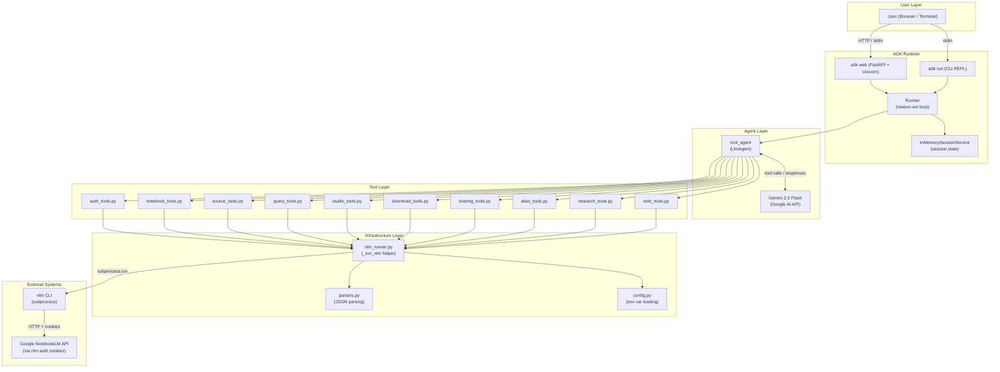

# Project Design: NotebookLM Agent using Google ADK

**Version**: 1.0
**Date**: 2026-04-10
**Status**: Complete
**Dependencies**: refined-request.md, plan-001-adk-nlm-agent.md, investigation-adk-nlm-agent.md, adk-functiontool-patterns.md, adk-session-state.md, nlm-json-schemas.md

---

## Table of Contents

1. [System Architecture](#1-system-architecture)
2. [Project Structure](#2-project-structure)
3. [Configuration Design](#3-configuration-design)
4. [Core Infrastructure Design](#4-core-infrastructure-design)
5. [Tool Design](#5-tool-design)
6. [Agent Design](#6-agent-design)
7. [Session State Design](#7-session-state-design)
8. [Error Handling Strategy](#8-error-handling-strategy)
9. [Interface Contracts Between Parallel Implementation Units](#9-interface-contracts-between-parallel-implementation-units)

---

## 1. System Architecture

### 1.1 Component Diagram



### 1.2 Data Flow: User Prompt to NotebookLM API Response

The following sequence describes a complete request lifecycle, using "list my notebooks" as an example:

```
1. User types: "List my notebooks"
   |
2. ADK Runner receives the message, creates/retrieves Session
   |
3. Runner sends message + system prompt + tool schemas to Gemini API
   |
4. Gemini reasons and returns: FunctionCall(name="list_notebooks", args={})
   |
5. Runner locates list_notebooks in tool registry, invokes it
   |
6. list_notebooks() calls _run_nlm(["notebook", "list", "--json"])
   |
7. _run_nlm() reads NLM_CLI_PATH from config.py (raises if missing)
   |
8. _run_nlm() executes: subprocess.run([nlm_path, "notebook", "list", "--json"],
                                        capture_output=True, text=True, timeout=30)
   |
9. nlm CLI authenticates via stored cookies (~/.notebooklm-mcp-cli/),
   calls Google NotebookLM API, returns JSON to stdout
   |
10. _run_nlm() parses stdout as JSON, classifies result:
    - returncode == 0 + valid JSON -> {"status": "success", "data": [...]}
    - returncode != 0 + auth keywords -> {"status": "auth_error", ...}
    - returncode != 0 + other -> {"status": "error", ...}
   |
11. list_notebooks() receives the result dict, truncates if >50 items,
    returns the dict to ADK
   |
12. Runner serializes the dict as FunctionResponse and sends it back to Gemini
   |
13. Gemini reads the tool response and generates a natural language answer:
    "You have 12 notebooks. Here are the most recent ones: ..."
   |
14. Runner yields the response event to the user interface
   |
15. User sees the formatted answer in the browser (adk web) or terminal (adk run)
```

### 1.3 Key Architectural Decisions

| Decision | Rationale |
|----------|-----------|
| Direct CLI subprocess wrapping (Approach A) | Simplicity, zero coupling to nlm internals, full control over output parsing and truncation |
| Synchronous `subprocess.run()` | Long-running ops are async on NotebookLM server side; sync is simpler; ADK wraps sync tools via `asyncio.to_thread()` so the event loop is not blocked |
| One tool per action (not grouped) | Gives Gemini clearer tool descriptions; reduces ambiguity in tool selection |
| `--json` flag on all supported commands | Reliable structured output; auto-TTY detection also triggers JSON when stdout is piped |
| `InMemorySessionService` for v1 | Development simplicity; `DatabaseSessionService` is a future upgrade (one-line change) |

---

## 2. Project Structure

### 2.1 Complete File Tree

```
108 - Google ADK/
|-- CLAUDE.md                                    # Project instructions and tool documentation
|-- Issues - Pending Items.md                    # Issue tracker (pending + completed items)
|-- pyproject.toml                               # UV project definition with google-adk dependency
|-- .python-version                              # Python version pin (3.12+)
|
|-- docs/
|   |-- design/
|   |   |-- project-design.md                    # THIS DOCUMENT - complete technical design
|   |   |-- project-functions.md                 # Functional requirements registry
|   |   |-- configuration-guide.md               # Configuration documentation
|   |   |-- plan-001-adk-nlm-agent.md            # Implementation plan
|   |
|   |-- reference/
|   |   |-- refined-request.md                   # Refined user request
|   |   |-- investigation-adk-nlm-agent.md       # Technical investigation
|   |   |-- workflow-checkpoint.json              # Workflow state
|   |
|   |-- research/
|       |-- adk-functiontool-patterns.md          # FunctionTool research
|       |-- adk-session-state.md                  # Session state research
|       |-- nlm-json-schemas.md                   # NLM JSON output schemas
|
|-- src/
|   |-- notebooklm_agent/                        # ADK agent package
|       |-- __init__.py                          # Exports root_agent
|       |-- agent.py                             # LlmAgent definition, system prompt, tool registration
|       |-- config.py                            # Strict env var loading (no fallback defaults)
|       |-- .env                                 # Local env vars (gitignored)
|       |-- .env.example                         # Documented example of all required vars
|       |
|       |-- tools/
|           |-- __init__.py                      # Exports all tool functions and FunctionTool wrappers
|           |-- nlm_runner.py                    # _run_nlm() helper, error classifier, version check
|           |-- parsers.py                       # JSON parsing utilities per command type
|           |-- auth_tools.py                    # check_auth()
|           |-- notebook_tools.py                # list_notebooks, get_notebook, create_notebook,
|           |                                    #   rename_notebook, delete_notebook, describe_notebook
|           |-- source_tools.py                  # add_source, list_sources, describe_source,
|           |                                    #   get_source_content, delete_source,
|           |                                    #   check_stale_sources, sync_sources
|           |-- query_tools.py                   # query_notebook
|           |-- studio_tools.py                  # create_audio, create_video, create_report,
|           |                                    #   create_quiz, create_flashcards, create_mindmap,
|           |                                    #   create_slides, create_infographic,
|           |                                    #   create_data_table, studio_status
|           |-- download_tools.py                # download_artifact
|           |-- sharing_tools.py                 # share_status, share_public, share_private, share_invite
|           |-- alias_tools.py                   # list_aliases, set_alias, get_alias, delete_alias
|           |-- research_tools.py                # start_research, research_status, import_research
|           |-- note_tools.py                    # list_notes, create_note, update_note, delete_note
|
|-- test_scripts/
    |-- test_nlm_runner.py                       # Unit tests for _run_nlm() with mocked subprocess
    |-- test_notebook_tools.py                   # Unit tests for notebook tools
    |-- test_source_tools.py                     # Unit tests for source tools
    |-- test_query_tools.py                      # Unit tests for query tools
    |-- test_studio_tools.py                     # Unit tests for studio tools
    |-- test_research_tools.py                   # Unit tests for research tools
    |-- test_alias_tools.py                      # Unit tests for alias tools
    |-- test_agent_smoke.py                      # Smoke test: start agent, send message
    |-- test_integration.py                      # End-to-end workflow tests (requires auth)
```

### 2.2 ADK Discovery Convention

ADK's `adk run` and `adk web` commands discover agents by looking for a Python package with an `__init__.py` that exports `root_agent`. The package must be a direct subdirectory of the working directory or the path passed to `adk run`.

For this project, the discovery command is:

```bash
cd "/Users/giorgosmarinos/aiwork/TrainingMaterial/108 - Google ADK/src"
adk run notebooklm_agent
# or
adk web --no-reload
```

The `src/` directory is the parent. `notebooklm_agent/` is the package. `__init__.py` exports `root_agent`.

### 2.3 `__init__.py` Design

```python
# src/notebooklm_agent/__init__.py

from .agent import root_agent

__all__ = ["root_agent"]
```

This single export is all ADK needs to discover and run the agent.

---

## 3. Configuration Design

### 3.1 Configuration Module: `config.py`

All configuration is loaded from environment variables. Per project conventions, **no fallback or default values are permitted**. Every missing variable raises an `EnvironmentError` with a descriptive message.

```python
# src/notebooklm_agent/config.py

import os
from dataclasses import dataclass


@dataclass(frozen=True)
class AgentConfig:
    """Immutable configuration for the NotebookLM agent.

    All values are loaded from environment variables.
    No fallback defaults are permitted per project conventions.
    """
    google_api_key: str
    nlm_cli_path: str
    gemini_model: str
    nlm_download_dir: str


def _require_env(name: str) -> str:
    """Read a required environment variable or raise with a descriptive message."""
    value = os.environ.get(name)
    if not value:
        raise EnvironmentError(
            f"{name} environment variable is required but not set. "
            f"Add it to the .env file in the agent directory or set it "
            f"in your shell environment."
        )
    return value


# Module-level singleton, initialized on first import.
# ADK loads .env from the agent directory before agent code runs,
# so os.environ will contain .env values at this point.
_config: AgentConfig | None = None


def get_config() -> AgentConfig:
    """Get the agent configuration. Raises EnvironmentError if any required var is missing."""
    global _config
    if _config is None:
        _config = AgentConfig(
            google_api_key=_require_env("GOOGLE_API_KEY"),
            nlm_cli_path=_require_env("NLM_CLI_PATH"),
            gemini_model=_require_env("GEMINI_MODEL"),
            nlm_download_dir=_require_env("NLM_DOWNLOAD_DIR"),
        )
    return _config
```

### 3.2 Required Environment Variables

| Variable | Purpose | How to Obtain | Example Value |
|----------|---------|---------------|---------------|
| `GOOGLE_API_KEY` | API key for Gemini model access via Google AI Studio | Create at https://aistudio.google.com/apikey | `AIzaSy...` |
| `NLM_CLI_PATH` | Absolute path to the `nlm` executable | Run `which nlm` after installing via `uv tool install notebooklm-mcp-cli` | `/Users/user/.local/bin/nlm` |
| `GEMINI_MODEL` | Gemini model name for the agent | Choose from https://ai.google.dev/gemini-api/docs/models | `gemini-2.5-flash` |
| `NLM_DOWNLOAD_DIR` | Directory where downloaded artifacts are saved | Create a directory for downloads | `/Users/user/Downloads/nlm-artifacts` |

### 3.3 `.env.example` Template

```bash
# src/notebooklm_agent/.env.example

# Google AI API key for Gemini model access.
# Obtain from: https://aistudio.google.com/apikey
GOOGLE_API_KEY=

# Absolute path to the nlm CLI executable.
# Find with: which nlm (after uv tool install notebooklm-mcp-cli)
NLM_CLI_PATH=

# Gemini model to use for the agent's reasoning.
# Options: gemini-2.5-flash, gemini-2.5-pro
GEMINI_MODEL=

# Directory for saving downloaded artifacts (audio, video, reports, etc.).
# Must exist and be writable.
NLM_DOWNLOAD_DIR=
```

### 3.4 How ADK Reads .env

ADK automatically loads a `.env` file from the agent package directory when using `adk run` or `adk web`. The load happens before agent code is imported, so `os.environ` contains `.env` values by the time `config.py` reads them. The `.env` file must be placed inside `src/notebooklm_agent/` (the agent package directory), not the project root.

### 3.5 Configuration Priority

1. Shell environment variables (highest priority -- override .env)
2. `.env` file in the agent package directory (loaded by ADK)

There is no config file, no CLI parameter, and no fallback default. Missing values always raise `EnvironmentError`.

---

## 4. Core Infrastructure Design

### 4.1 `nlm_runner.py`: The `_run_nlm()` Helper

This is the single most critical function in the project. All tool functions delegate to it. It is the shared contract that enables parallel development of tool modules.

#### 4.1.1 Type Definitions

```python
# src/notebooklm_agent/tools/nlm_runner.py

import json
import logging
import subprocess
from typing import TypedDict, NotRequired

from ..config import get_config

logger = logging.getLogger(__name__)

# Tested NLM CLI version. A warning is logged if the installed version differs.
TESTED_NLM_VERSION = "0.5.6"


class NlmResult(TypedDict):
    """Result dictionary returned by _run_nlm().

    Every call to _run_nlm() returns a dict matching this structure.
    The 'status' field is always present. Other fields depend on the status value.
    """
    status: str                    # "success" | "auth_error" | "not_found" |
                                   # "rate_limit" | "timeout" | "config_error" | "error"
    data: NotRequired[object]      # Parsed JSON (when status is "success" and JSON was returned)
    output: NotRequired[str]       # Raw text (when status is "success" but no JSON)
    error: NotRequired[str]        # Error message (when status is not "success")
    action: NotRequired[str]       # Suggested user action (for auth_error, config_error)
    hint: NotRequired[str]         # Optional hint from nlm error output
```

#### 4.1.2 `_run_nlm()` Implementation

```python
def _run_nlm(args: list[str], timeout: int = 60) -> dict:
    """Execute an nlm CLI command and return a classified result dict.

    This function is the sole interface between ADK tools and the nlm CLI.
    It handles:
    - Reading the NLM_CLI_PATH from configuration
    - Executing the subprocess with capture_output and timeout
    - Parsing JSON stdout
    - Classifying errors into actionable categories
    - Catching all exceptions (tools must never raise)

    Args:
        args: Command arguments to pass to nlm (e.g., ["notebook", "list", "--json"]).
        timeout: Maximum seconds to wait for the command to complete.

    Returns:
        A dict with at minimum a 'status' key. See NlmResult TypedDict for the
        complete structure. The LLM reads this dict to understand the outcome.

    Example:
        >>> result = _run_nlm(["notebook", "list", "--json"], timeout=30)
        >>> result["status"]
        'success'
        >>> result["data"]
        [{"id": "abc", "title": "My Notebook", ...}]
    """
    config = get_config()
    nlm_path = config.nlm_cli_path

    try:
        result = subprocess.run(
            [nlm_path] + args,
            capture_output=True,
            text=True,
            timeout=timeout,
        )

        if result.returncode != 0:
            stderr = result.stderr.strip()
            stdout = result.stdout.strip()

            # Check stdout for JSON error format: {"status": "error", "error": "...", "hint": "..."}
            error_msg = stderr or stdout
            hint = None
            try:
                json_err = json.loads(stdout)
                if isinstance(json_err, dict) and json_err.get("status") == "error":
                    error_msg = json_err.get("error", error_msg)
                    hint = json_err.get("hint")
            except (json.JSONDecodeError, TypeError):
                pass

            # Classify the error
            error_lower = error_msg.lower()

            if "expired" in error_lower or "authentication" in error_lower or "login" in error_lower:
                return {
                    "status": "auth_error",
                    "error": error_msg,
                    "action": "The user must run 'nlm login' in their terminal to re-authenticate.",
                    **({"hint": hint} if hint else {}),
                }

            if "not found" in error_lower or "does not exist" in error_lower:
                return {
                    "status": "not_found",
                    "error": error_msg,
                    **({"hint": hint} if hint else {}),
                }

            if "429" in error_msg or "rate limit" in error_lower or "quota" in error_lower:
                return {
                    "status": "rate_limit",
                    "error": "NotebookLM API rate limit reached (~50 queries/day).",
                    "action": "Wait before retrying. The free tier allows approximately 50 API queries per day.",
                }

            return {
                "status": "error",
                "error": error_msg,
                **({"hint": hint} if hint else {}),
            }

        # Command succeeded -- parse stdout
        stdout = result.stdout.strip()
        if not stdout:
            return {"status": "success", "data": None}

        try:
            parsed = json.loads(stdout)
        except json.JSONDecodeError:
            # Command succeeded but returned non-JSON (e.g., studio create commands)
            return {"status": "success", "output": stdout}

        # Check if the JSON itself reports an error
        if isinstance(parsed, dict) and parsed.get("status") == "error":
            return {
                "status": "error",
                "error": parsed.get("error", "Unknown error from nlm"),
                **({"hint": parsed.get("hint")} if parsed.get("hint") else {}),
            }

        return {"status": "success", "data": parsed}

    except subprocess.TimeoutExpired:
        return {
            "status": "timeout",
            "error": f"nlm command timed out after {timeout}s. The command was: nlm {' '.join(args)}",
        }

    except FileNotFoundError:
        return {
            "status": "config_error",
            "error": f"nlm executable not found at '{nlm_path}'.",
            "action": "Verify that NLM_CLI_PATH in .env points to a valid nlm executable.",
        }

    except PermissionError:
        return {
            "status": "config_error",
            "error": f"Permission denied when executing '{nlm_path}'.",
            "action": "Check file permissions on the nlm executable.",
        }

    except Exception as e:
        # Last-resort catch -- tools must never let exceptions propagate to ADK
        logger.exception("Unexpected error in _run_nlm")
        return {
            "status": "error",
            "error": f"Unexpected error: {type(e).__name__}: {e}",
        }
```

#### 4.1.3 `check_nlm_version()` Implementation

```python
def check_nlm_version() -> str:
    """Check the installed nlm version and log a warning if it differs from the tested version.

    Returns:
        The version string reported by nlm, or "unknown" if the check fails.
    """
    config = get_config()
    try:
        result = subprocess.run(
            [config.nlm_cli_path, "--version"],
            capture_output=True,
            text=True,
            timeout=5,
        )
        version = result.stdout.strip()
        if TESTED_NLM_VERSION not in version:
            logger.warning(
                "nlm version mismatch: agent tested against v%s, found '%s'. "
                "JSON schemas may differ.",
                TESTED_NLM_VERSION,
                version,
            )
        return version
    except Exception as e:
        logger.warning("Failed to check nlm version: %s", e)
        return "unknown"
```

#### 4.1.4 Timeout Configuration by Operation Category

| Category | Timeout (s) | Commands |
|----------|:-----------:|---------|
| Fast read ops | 30 | `notebook list`, `notebook get`, `notebook create`, `notebook rename`, `source list`, `alias *`, `login --check`, `share status` |
| Medium ops | 60 | `notebook query`, `source add` (no --wait), `studio create *`, `share public/private/invite`, `note *` |
| Long write ops | 120 | `source add --wait`, `download *`, `research start`, `notebook delete`, `source delete` |
| Extra long ops | 360 | `research status` (deep mode polling) |

These timeouts are not configured via environment variables. They are constants in `nlm_runner.py`:

```python
# Timeout presets (seconds)
TIMEOUT_FAST = 30
TIMEOUT_MEDIUM = 60
TIMEOUT_LONG = 120
TIMEOUT_EXTRA_LONG = 360
```

#### 4.1.5 Auto-TTY Detection

When `nlm` is called via `subprocess.run()` with `capture_output=True`, stdout is a pipe (not a TTY). The nlm CLI's `detect_output_format()` function automatically switches to JSON output format when stdout is not a TTY. This means the agent receives JSON even without the explicit `--json` flag.

However, **the `--json` flag must always be passed explicitly** for two reasons:
1. Robustness: if the auto-detection logic changes, the explicit flag guarantees JSON output
2. Clarity: code is self-documenting about expected output format

### 4.2 `parsers.py`: JSON Parsing Utilities

The parsers module provides defensive parsing functions for each nlm output schema. All functions use `.get()` with defaults and never assume a field is present.

```python
# src/notebooklm_agent/tools/parsers.py

import json
from typing import Any


def parse_json_output(raw: str) -> Any:
    """Parse raw stdout as JSON. Returns parsed data or raises ValueError."""
    try:
        return json.loads(raw)
    except json.JSONDecodeError as e:
        raise ValueError(f"nlm returned invalid JSON: {e}") from e


def normalize_notebook(item: dict) -> dict:
    """Normalize a single notebook dict from nlm output.

    Guarantees fields: id, title, source_count. Optional: updated_at.
    """
    return {
        "id": item.get("id") or item.get("notebook_id", ""),
        "title": item.get("title", "Untitled"),
        "source_count": item.get("source_count", 0),
        "updated_at": item.get("updated_at"),
    }


def normalize_source(item: dict) -> dict:
    """Normalize a single source dict from nlm output.

    Guarantees fields: id, title, type. Optional: url.
    """
    return {
        "id": item.get("id", ""),
        "title": item.get("title", "Untitled"),
        "type": item.get("source_type_name") or item.get("type", "unknown"),
        "url": item.get("url", ""),
    }


def normalize_artifact(item: dict) -> dict:
    """Normalize a single studio artifact dict from nlm output.

    Guarantees fields: id, type, status.
    """
    return {
        "id": item.get("artifact_id") or item.get("id", ""),
        "type": item.get("type", "unknown"),
        "status": item.get("status", "unknown"),
    }


def normalize_query_result(data: dict) -> dict:
    """Normalize a query result dict from nlm output.

    Guarantees fields: answer, conversation_id, sources_used.
    Intentionally omits citations/references (unstable structure).
    """
    return {
        "answer": data.get("answer", ""),
        "conversation_id": data.get("conversation_id"),
        "sources_used": data.get("sources_used", []),
    }


def truncate_list(items: list, max_items: int) -> dict:
    """Truncate a list and return metadata about truncation.

    Returns:
        dict with keys: items (truncated list), total_count, truncated (bool).
    """
    total = len(items)
    if total <= max_items:
        return {"items": items, "total_count": total, "truncated": False}
    return {
        "items": items[:max_items],
        "total_count": total,
        "truncated": True,
        "note": f"Showing {max_items} of {total} items. Ask the user to filter if needed.",
    }
```

---

## 5. Tool Design

Each subsection below defines the tools for one category. For each tool:
- **Function signature** with typed parameters
- **Docstring** (exactly what Gemini sees)
- **NLM command** it wraps
- **Return format** to the LLM
- **`require_confirmation`** flag (if applicable)
- **Session state writes** (if applicable)

### 5.1 Authentication Tools

#### `check_auth()`

```python
def check_auth() -> dict:
    """Check if the nlm CLI is authenticated with Google NotebookLM.

    Call this before performing any NotebookLM operations if you are
    unsure whether the user is logged in. If authentication has expired,
    tell the user to run 'nlm login' in their terminal.

    Returns:
        Dictionary with status and authentication details.
        - status: "success" if authenticated, "auth_error" if not.
        - authenticated: boolean indicating auth state.
        - message: human-readable status message.
    """
    result = _run_nlm(["login", "--check"], timeout=TIMEOUT_FAST)
    if result["status"] == "success":
        return {
            "status": "success",
            "authenticated": True,
            "message": "nlm CLI is authenticated and ready.",
        }
    return {
        "status": "auth_error",
        "authenticated": False,
        "message": result.get("error", "Authentication check failed."),
        "action": "The user must run 'nlm login' in their terminal.",
    }
```

- **NLM command**: `nlm login --check`
- **`require_confirmation`**: No
- **Session state**: No writes

---

### 5.2 Notebook Tools

#### `list_notebooks()`

```python
def list_notebooks() -> dict:
    """List all notebooks in the user's Google NotebookLM collection.

    Returns a summary of all notebooks including their IDs, titles,
    source counts, and last update timestamps. Results are limited
    to the 50 most recent notebooks.

    Returns:
        Dictionary with status and a list of notebook objects.
    """
```

- **NLM command**: `nlm notebook list --json`
- **Return**: `{"status": "success", "notebooks": [...], "total_count": N, "truncated": bool}`
- **Truncation**: Max 50 items via `truncate_list()`
- **`require_confirmation`**: No
- **Session state**: No writes

#### `get_notebook(notebook_id: str, tool_context: ToolContext)`

```python
def get_notebook(notebook_id: str, tool_context: ToolContext) -> dict:
    """Get detailed information about a specific notebook.

    Retrieves the notebook's title, source count, web URL, and list of
    sources. Also sets this notebook as the current active notebook
    in the session.

    Args:
        notebook_id: The UUID of the notebook to retrieve.
        tool_context: ADK tool context (injected automatically).

    Returns:
        Dictionary with status and notebook details including sources.
    """
```

- **NLM command**: `nlm notebook get <id> --json`
- **Return**: `{"status": "success", "notebook": {id, title, source_count, url, sources[]}}`
- **`require_confirmation`**: No
- **Session state writes**:
  - `current_notebook_id` = notebook_id
  - `current_notebook_title` = notebook title from response

#### `create_notebook(title: str, tool_context: ToolContext)`

```python
def create_notebook(title: str, tool_context: ToolContext) -> dict:
    """Create a new notebook in Google NotebookLM.

    Creates an empty notebook with the given title. The new notebook
    becomes the current active notebook in the session.

    Args:
        title: The title for the new notebook.
        tool_context: ADK tool context (injected automatically).

    Returns:
        Dictionary with status and the new notebook's ID and title.
    """
```

- **NLM command**: `nlm notebook create "<title>"`
- **Return**: `{"status": "success", "notebook_id": "...", "title": "..."}`
- **`require_confirmation`**: No
- **Session state writes**:
  - `current_notebook_id` = new notebook ID
  - `current_notebook_title` = title

#### `rename_notebook(notebook_id: str, new_title: str)`

```python
def rename_notebook(notebook_id: str, new_title: str) -> dict:
    """Rename an existing notebook.

    Args:
        notebook_id: The UUID of the notebook to rename.
        new_title: The new title for the notebook.

    Returns:
        Dictionary with status and confirmation message.
    """
```

- **NLM command**: `nlm notebook rename <id> "<new_title>"`
- **`require_confirmation`**: No
- **Session state**: No writes

#### `delete_notebook(notebook_id: str)`

```python
def delete_notebook(notebook_id: str) -> dict:
    """Permanently delete a notebook and all its contents.

    WARNING: This action is irreversible. The notebook, all its sources,
    and all generated studio content will be permanently deleted.

    Args:
        notebook_id: The UUID of the notebook to delete.

    Returns:
        Dictionary with status and confirmation message.
    """
```

- **NLM command**: `nlm notebook delete <id> --confirm`
- **`require_confirmation`**: **Yes** -- wrapped as `FunctionTool(func=delete_notebook, require_confirmation=True)`
- **Session state**: No writes (the agent should clear `current_notebook_id` if it matches)

#### `describe_notebook(notebook_id: str)`

```python
def describe_notebook(notebook_id: str) -> dict:
    """Get an AI-generated summary description of a notebook's contents.

    Returns a summary of the notebook's topics and a list of suggested
    discussion topics based on the notebook's sources.

    Args:
        notebook_id: The UUID of the notebook to describe.

    Returns:
        Dictionary with status, summary text, and suggested topics.
    """
```

- **NLM command**: `nlm notebook describe <id> --json`
- **Return**: `{"status": "success", "summary": "...", "suggested_topics": [...]}`
- **`require_confirmation`**: No
- **Session state**: No writes

---

### 5.3 Source Tools

#### `add_source(notebook_id: str, source_type: str, source_value: str)`

```python
def add_source(notebook_id: str, source_type: str, source_value: str) -> dict:
    """Add a source to a notebook.

    Adds a URL, text content, local file, or Google Drive document
    as a source to the specified notebook. Source processing is
    asynchronous and may take 2-5 minutes after adding.

    Args:
        notebook_id: The UUID of the target notebook.
        source_type: Type of source. Must be one of: "url", "text", "file", "drive".
        source_value: The source content. For "url": a URL string.
            For "text": the text content. For "file": absolute file path.
            For "drive": Google Drive document ID.

    Returns:
        Dictionary with status and source details.
    """
```

- **NLM command**: `nlm source add <nb> --url/--text/--file/--drive <value> --json`
- **Parameter mapping**: `source_type` maps to the CLI flag (`--url`, `--text`, `--file`, `--drive`)
- **Validation**: The tool validates `source_type` before calling nlm
- **`require_confirmation`**: No
- **Session state**: No writes

#### `list_sources(notebook_id: str)`

```python
def list_sources(notebook_id: str) -> dict:
    """List all sources in a notebook.

    Returns details about each source including its ID, title, type,
    and URL. Results are limited to 30 sources.

    Args:
        notebook_id: The UUID of the notebook.

    Returns:
        Dictionary with status and list of source objects.
    """
```

- **NLM command**: `nlm source list <nb> --json`
- **Truncation**: Max 30 items
- **`require_confirmation`**: No

#### `describe_source(source_id: str)`

```python
def describe_source(source_id: str) -> dict:
    """Get an AI-generated summary of a specific source.

    Args:
        source_id: The UUID of the source to describe.

    Returns:
        Dictionary with status, summary text, and keywords.
    """
```

- **NLM command**: `nlm source describe <id> --json`
- **Return**: `{"status": "success", "summary": "...", "keywords": [...]}`

#### `get_source_content(source_id: str)`

```python
def get_source_content(source_id: str) -> dict:
    """Read the text content of a source.

    Returns the full text content of the source, its title, type,
    and character count. Content is truncated to 2000 characters
    to manage token usage.

    Args:
        source_id: The UUID of the source to read.

    Returns:
        Dictionary with status, content text, title, type, and char_count.
    """
```

- **NLM command**: `nlm source content <id> --json`
- **Truncation**: Content truncated to 2000 characters with `truncated: true` flag
- **Return**: `{"status": "success", "content": "...", "title": "...", "source_type": "...", "char_count": N, "truncated": bool}`

#### `delete_source(notebook_id: str, source_id: str)`

```python
def delete_source(notebook_id: str, source_id: str) -> dict:
    """Permanently delete a source from a notebook.

    WARNING: This action is irreversible.

    Args:
        notebook_id: The UUID of the notebook containing the source.
        source_id: The UUID of the source to delete.

    Returns:
        Dictionary with status and confirmation message.
    """
```

- **NLM command**: `nlm source delete <nb> <id> --confirm`
- **`require_confirmation`**: **Yes**

#### `check_stale_sources(notebook_id: str)`

```python
def check_stale_sources(notebook_id: str) -> dict:
    """Check for stale Google Drive sources in a notebook.

    Identifies sources linked to Google Drive documents that have
    been updated since they were last synced.

    Args:
        notebook_id: The UUID of the notebook to check.

    Returns:
        Dictionary with status and list of stale sources.
    """
```

- **NLM command**: `nlm source stale <nb>`

#### `sync_sources(notebook_id: str)`

```python
def sync_sources(notebook_id: str) -> dict:
    """Sync all stale Google Drive sources in a notebook.

    Updates sources linked to Google Drive documents that have
    changed since their last sync.

    Args:
        notebook_id: The UUID of the notebook to sync.

    Returns:
        Dictionary with status and sync results.
    """
```

- **NLM command**: `nlm source sync <nb>`

---

### 5.4 Query Tools

#### `query_notebook(notebook_id: str, question: str, conversation_id: str = None, tool_context: ToolContext)`

```python
def query_notebook(
    notebook_id: str,
    question: str,
    conversation_id: str = None,
    tool_context: ToolContext = None,
) -> dict:
    """Ask a question about a notebook's content.

    Queries the notebook's sources using NotebookLM's AI to answer
    the question. For follow-up questions in the same conversation
    thread, the conversation_id is automatically reused from
    session state.

    Note: Queries are rate-limited to approximately 50 per day.

    Args:
        notebook_id: The UUID of the notebook to query.
        question: The natural language question to ask.
        conversation_id: Optional conversation ID for follow-up questions.
            If not provided, uses the last conversation ID from session state.
        tool_context: ADK tool context (injected automatically).

    Returns:
        Dictionary with status, answer text, conversation ID for follow-ups,
        and list of source IDs that were cited.
    """
```

- **NLM command**: `nlm notebook query <nb> "<question>" --json [--conversation-id <id>]`
- **Return**: `{"status": "success", "answer": "...", "conversation_id": "...", "sources_used": [...]}`
- **Conversation ID logic**:
  1. If `conversation_id` parameter is provided, use it
  2. Else if `tool_context.state.get("last_conversation_id")` exists, use it
  3. Else omit `--conversation-id` (starts new conversation)
- **`require_confirmation`**: No
- **Session state writes**:
  - `last_conversation_id` = conversation_id from response

---

### 5.5 Studio Tools

All studio creation tools share a common pattern:
1. Execute the `nlm <type> create` command with `--confirm` (auto-confirm for non-interactive execution)
2. Studio create commands do NOT support `--json` -- parse exit code only
3. Return a success message directing the user to check status

#### `create_audio(notebook_id: str, format: str = "deep_dive", length: str = "default")`

```python
def create_audio(
    notebook_id: str,
    format: str = "deep_dive",
    length: str = "default",
) -> dict:
    """Generate a podcast-style audio overview of a notebook.

    Creates an audio conversation that discusses the notebook's
    content. Generation takes 1-5 minutes. Use studio_status
    to check progress.

    Args:
        notebook_id: The UUID of the notebook.
        format: Audio format. Options: "deep_dive" (detailed discussion),
            "brief" (short summary), "critique" (critical analysis),
            "debate" (opposing viewpoints).
        length: Audio length. Options: "short", "default", "long".

    Returns:
        Dictionary with status and a message about the generation.
    """
```

- **NLM command**: `nlm audio create <nb> --format <f> --length <l> --confirm`
- **Return**: `{"status": "success", "message": "Audio generation started. Use studio_status to check progress."}`

#### `create_video(notebook_id: str, format: str = "explainer", style: str = None)`

```python
def create_video(
    notebook_id: str,
    format: str = "explainer",
    style: str = None,
) -> dict:
    """Generate a video overview of a notebook.

    Creates a video that presents the notebook's content visually.
    Generation takes 1-5 minutes. Use studio_status to check progress.

    Args:
        notebook_id: The UUID of the notebook.
        format: Video format. Options: "explainer", "brief".
        style: Optional style modifier for the video.

    Returns:
        Dictionary with status and a message about the generation.
    """
```

- **NLM command**: `nlm video create <nb> --format <f> [--style <s>] --confirm`

#### `create_report(notebook_id: str, format: str = "Briefing Doc")`

```python
def create_report(notebook_id: str, format: str = "Briefing Doc") -> dict:
    """Generate a written report from a notebook's content.

    Args:
        notebook_id: The UUID of the notebook.
        format: Report format. Options: "Briefing Doc", "Study Guide",
            "Blog Post", "Create Your Own".

    Returns:
        Dictionary with status and a message about the generation.
    """
```

- **NLM command**: `nlm report create <nb> --format "<f>" --confirm`

#### `create_quiz(notebook_id: str, count: int = 5, difficulty: int = 3)`

```python
def create_quiz(notebook_id: str, count: int = 5, difficulty: int = 3) -> dict:
    """Generate a quiz based on a notebook's content.

    Args:
        notebook_id: The UUID of the notebook.
        count: Number of quiz questions (1-20).
        difficulty: Difficulty level (1-5, where 1 is easiest).

    Returns:
        Dictionary with status and a message about the generation.
    """
```

- **NLM command**: `nlm quiz create <nb> --count <n> --difficulty <d> --confirm`

#### `create_flashcards(notebook_id: str, difficulty: str = "medium")`

```python
def create_flashcards(notebook_id: str, difficulty: str = "medium") -> dict:
    """Generate flashcards from a notebook's content.

    Args:
        notebook_id: The UUID of the notebook.
        difficulty: Flashcard difficulty. Options: "easy", "medium", "hard".

    Returns:
        Dictionary with status and a message about the generation.
    """
```

- **NLM command**: `nlm flashcards create <nb> --difficulty <d> --confirm`

#### `create_mindmap(notebook_id: str, title: str = None)`

```python
def create_mindmap(notebook_id: str, title: str = None) -> dict:
    """Generate a mind map visualization of a notebook's content.

    Args:
        notebook_id: The UUID of the notebook.
        title: Optional custom title for the mind map.

    Returns:
        Dictionary with status and a message about the generation.
    """
```

- **NLM command**: `nlm mindmap create <nb> [--title "<t>"] --confirm`

#### `create_slides(notebook_id: str, format: str = "detailed_deck")`

```python
def create_slides(notebook_id: str, format: str = "detailed_deck") -> dict:
    """Generate a slide deck from a notebook's content.

    Args:
        notebook_id: The UUID of the notebook.
        format: Slide format. Options: "detailed_deck", "presenter_slides".

    Returns:
        Dictionary with status and a message about the generation.
    """
```

- **NLM command**: `nlm slides create <nb> --format <f> --confirm`

#### `create_infographic(notebook_id: str, orientation: str = "landscape", detail: str = "standard")`

```python
def create_infographic(
    notebook_id: str,
    orientation: str = "landscape",
    detail: str = "standard",
) -> dict:
    """Generate an infographic from a notebook's content.

    Args:
        notebook_id: The UUID of the notebook.
        orientation: Image orientation. Options: "landscape", "portrait", "square".
        detail: Detail level. Options: "concise", "standard", "detailed".

    Returns:
        Dictionary with status and a message about the generation.
    """
```

- **NLM command**: `nlm infographic create <nb> --orientation <o> --detail <d> --confirm`

#### `create_data_table(notebook_id: str, description: str)`

```python
def create_data_table(notebook_id: str, description: str) -> dict:
    """Generate a structured data table from a notebook's content.

    Args:
        notebook_id: The UUID of the notebook.
        description: Description of the data to extract into a table.

    Returns:
        Dictionary with status and a message about the generation.
    """
```

- **NLM command**: `nlm data-table create <nb> "<description>" --confirm`

#### `studio_status(notebook_id: str)`

```python
def studio_status(notebook_id: str) -> dict:
    """Check the status of all studio artifacts for a notebook.

    Returns the list of all generated artifacts (audio, video,
    reports, etc.) with their current status (completed, in_progress,
    pending, failed).

    Note: Mind maps may not appear in the status unless --full is used.

    Args:
        notebook_id: The UUID of the notebook.

    Returns:
        Dictionary with status, list of artifacts, and summary counts.
    """
```

- **NLM command**: `nlm studio status <nb> --json`
- **Return**: `{"status": "success", "artifacts": [...], "completed_count": N, "pending_count": N, "failed_count": N}`

**All studio creation tools**:
- **`require_confirmation`**: No (the `--confirm` flag is always passed to nlm for non-interactive execution)
- **Session state**: No writes

---

### 5.6 Download Tools

#### `download_artifact(notebook_id: str, artifact_type: str, artifact_id: str, output_path: str = None)`

```python
def download_artifact(
    notebook_id: str,
    artifact_type: str,
    artifact_id: str,
    output_path: str = None,
) -> dict:
    """Download a completed studio artifact to a local file.

    Downloads an artifact that has been generated by studio. The artifact
    must have a "completed" status. If no output path is specified,
    the file is saved to the configured download directory.

    Args:
        notebook_id: The UUID of the notebook.
        artifact_type: Type of artifact to download. Options: "audio",
            "video", "report", "mind-map", "slide-deck", "infographic",
            "data-table", "quiz", "flashcards".
        artifact_id: The UUID of the specific artifact to download.
        output_path: Optional custom file path for the download.
            If not provided, uses NLM_DOWNLOAD_DIR from configuration.

    Returns:
        Dictionary with status, file path, and confirmation message.
    """
```

- **NLM command**: `nlm download <type> <nb> --id <id> --output <path>`
- **Default output**: If `output_path` is None, uses `get_config().nlm_download_dir`
- **Validation**: Checks that the output directory exists and is writable before calling nlm
- **`require_confirmation`**: No
- **Session state**: No writes

---

### 5.7 Sharing Tools

#### `share_status(notebook_id: str)`

```python
def share_status(notebook_id: str) -> dict:
    """Check the sharing status of a notebook.

    Returns whether the notebook is publicly shared and lists
    all collaborators with their roles.

    Args:
        notebook_id: The UUID of the notebook.

    Returns:
        Dictionary with status, public/private flag, and collaborator list.
    """
```

- **NLM command**: `nlm share status <nb>`
- **Note**: This command does not support `--json`. Output is parsed from text.

#### `share_public(notebook_id: str)`

```python
def share_public(notebook_id: str) -> dict:
    """Make a notebook publicly accessible via a shareable link.

    Args:
        notebook_id: The UUID of the notebook.

    Returns:
        Dictionary with status, message, and the public URL.
    """
```

- **NLM command**: `nlm share public <nb>`

#### `share_private(notebook_id: str)`

```python
def share_private(notebook_id: str) -> dict:
    """Make a notebook private (disable public sharing link).

    Args:
        notebook_id: The UUID of the notebook.

    Returns:
        Dictionary with status and confirmation message.
    """
```

- **NLM command**: `nlm share private <nb>`

#### `share_invite(notebook_id: str, email: str, role: str = "viewer")`

```python
def share_invite(notebook_id: str, email: str, role: str = "viewer") -> dict:
    """Invite a collaborator to a notebook.

    Args:
        notebook_id: The UUID of the notebook.
        email: Email address of the person to invite.
        role: Permission role. Options: "viewer" (read-only), "editor" (read-write).

    Returns:
        Dictionary with status and confirmation message.
    """
```

- **NLM command**: `nlm share invite <nb> <email> --role <role>`

**All sharing tools**:
- **`require_confirmation`**: No
- **Session state**: No writes

---

### 5.8 Alias Tools

#### `list_aliases()`

```python
def list_aliases() -> dict:
    """List all notebook aliases.

    Aliases are human-friendly names for notebook UUIDs, making
    it easier to reference notebooks by name instead of long IDs.

    Returns:
        Dictionary with status and list of alias name-to-ID mappings.
    """
```

- **NLM command**: `nlm alias list`

#### `set_alias(name: str, notebook_id: str)`

```python
def set_alias(name: str, notebook_id: str) -> dict:
    """Create or update a notebook alias.

    Args:
        name: The alias name (human-friendly shortcut).
        notebook_id: The UUID of the notebook to associate.

    Returns:
        Dictionary with status and confirmation message.
    """
```

- **NLM command**: `nlm alias set <name> <uuid>`

#### `get_alias(name: str)`

```python
def get_alias(name: str) -> dict:
    """Look up the notebook ID for an alias.

    Args:
        name: The alias name to look up.

    Returns:
        Dictionary with status and the associated notebook ID.
    """
```

- **NLM command**: `nlm alias get <name>`

#### `delete_alias(name: str)`

```python
def delete_alias(name: str) -> dict:
    """Delete a notebook alias.

    Args:
        name: The alias name to delete.

    Returns:
        Dictionary with status and confirmation message.
    """
```

- **NLM command**: `nlm alias delete <name>`

**All alias tools**:
- **`require_confirmation`**: No
- **Session state**: No writes

---

### 5.9 Research Tools

#### `start_research(notebook_id: str, query: str, mode: str = "fast", source: str = "web")`

```python
def start_research(
    notebook_id: str,
    query: str,
    mode: str = "fast",
    source: str = "web",
) -> dict:
    """Start a research task to discover new sources for a notebook.

    Initiates a background research process that searches for relevant
    sources based on the query. Fast mode takes ~30 seconds; deep mode
    can take up to 5 minutes.

    Args:
        notebook_id: The UUID of the notebook to add discovered sources to.
        query: The research query describing what to search for.
        mode: Research depth. Options: "fast" (~30s), "deep" (~5 minutes).
        source: Where to search. Options: "web", "drive".

    Returns:
        Dictionary with status and a message about the research task.
    """
```

- **NLM command**: `nlm research start "<query>" --notebook-id <nb> --mode <m> --source <s>`
- **Note**: No `--json` support. Parse text output for task ID.

#### `research_status(notebook_id: str)`

```python
def research_status(notebook_id: str) -> dict:
    """Check the status of the most recent research task for a notebook.

    Returns the current status of the research (pending, running,
    completed, failed) and any discovered sources.

    Args:
        notebook_id: The UUID of the notebook.

    Returns:
        Dictionary with status, research state, and discovered sources count.
    """
```

- **NLM command**: `nlm research status <nb>`
- **Note**: No `--json` support. Parse text output.

#### `import_research(notebook_id: str)`

```python
def import_research(notebook_id: str) -> dict:
    """Import discovered research sources into a notebook.

    Adds the sources found by a completed research task as actual
    sources in the notebook. The research task must be completed first.

    Args:
        notebook_id: The UUID of the notebook.

    Returns:
        Dictionary with status and import results.
    """
```

- **NLM command**: `nlm research import <nb>`

**All research tools**:
- **`require_confirmation`**: No
- **Session state**: No writes

---

### 5.10 Note Tools

#### `list_notes(notebook_id: str)`

```python
def list_notes(notebook_id: str) -> dict:
    """List all notes in a notebook.

    Args:
        notebook_id: The UUID of the notebook.

    Returns:
        Dictionary with status and list of notes.
    """
```

- **NLM command**: `nlm note list <nb>`

#### `create_note(notebook_id: str, content: str)`

```python
def create_note(notebook_id: str, content: str) -> dict:
    """Create a new note in a notebook.

    Args:
        notebook_id: The UUID of the notebook.
        content: The text content of the note.

    Returns:
        Dictionary with status and the new note's details.
    """
```

- **NLM command**: `nlm note create <nb> --content "<content>"`

#### `update_note(notebook_id: str, note_id: str, content: str)`

```python
def update_note(notebook_id: str, note_id: str, content: str) -> dict:
    """Update an existing note's content.

    Args:
        notebook_id: The UUID of the notebook.
        note_id: The UUID of the note to update.
        content: The new text content for the note.

    Returns:
        Dictionary with status and confirmation message.
    """
```

- **NLM command**: `nlm note update <nb> <note_id> --content "<content>"`

#### `delete_note(notebook_id: str, note_id: str)`

```python
def delete_note(notebook_id: str, note_id: str) -> dict:
    """Permanently delete a note from a notebook.

    Args:
        notebook_id: The UUID of the notebook.
        note_id: The UUID of the note to delete.

    Returns:
        Dictionary with status and confirmation message.
    """
```

- **NLM command**: `nlm note delete <nb> <note_id> --confirm`
- **`require_confirmation`**: **Yes**

---

### 5.11 Tool Summary Table

| Category | Tool Function | `require_confirmation` | Writes Session State | Timeout |
|----------|--------------|:---:|:---:|:---:|
| Auth | `check_auth` | No | No | FAST (30s) |
| Notebooks | `list_notebooks` | No | No | FAST |
| | `get_notebook` | No | Yes | FAST |
| | `create_notebook` | No | Yes | FAST |
| | `rename_notebook` | No | No | FAST |
| | `delete_notebook` | **Yes** | No | LONG (120s) |
| | `describe_notebook` | No | No | MEDIUM (60s) |
| Sources | `add_source` | No | No | MEDIUM |
| | `list_sources` | No | No | FAST |
| | `describe_source` | No | No | MEDIUM |
| | `get_source_content` | No | No | MEDIUM |
| | `delete_source` | **Yes** | No | LONG |
| | `check_stale_sources` | No | No | FAST |
| | `sync_sources` | No | No | MEDIUM |
| Queries | `query_notebook` | No | Yes | MEDIUM |
| Studio | `create_audio` | No | No | MEDIUM |
| | `create_video` | No | No | MEDIUM |
| | `create_report` | No | No | MEDIUM |
| | `create_quiz` | No | No | MEDIUM |
| | `create_flashcards` | No | No | MEDIUM |
| | `create_mindmap` | No | No | MEDIUM |
| | `create_slides` | No | No | MEDIUM |
| | `create_infographic` | No | No | MEDIUM |
| | `create_data_table` | No | No | MEDIUM |
| | `studio_status` | No | No | FAST |
| Downloads | `download_artifact` | No | No | LONG |
| Sharing | `share_status` | No | No | FAST |
| | `share_public` | No | No | MEDIUM |
| | `share_private` | No | No | MEDIUM |
| | `share_invite` | No | No | MEDIUM |
| Aliases | `list_aliases` | No | No | FAST |
| | `set_alias` | No | No | FAST |
| | `get_alias` | No | No | FAST |
| | `delete_alias` | No | No | FAST |
| Research | `start_research` | No | No | LONG |
| | `research_status` | No | No | EXTRA_LONG (360s) |
| | `import_research` | No | No | LONG |
| Notes | `list_notes` | No | No | FAST |
| | `create_note` | No | No | MEDIUM |
| | `update_note` | No | No | MEDIUM |
| | `delete_note` | **Yes** | No | MEDIUM |

**Total: 41 tools** (4 with `require_confirmation`, 3 write session state)

---

## 6. Agent Design

### 6.1 `agent.py`: The `root_agent` Definition

```python
# src/notebooklm_agent/agent.py

from google.adk.agents import LlmAgent
from google.adk.tools import FunctionTool

from .config import get_config
from .tools import (
    # Auth
    check_auth,
    # Notebooks
    list_notebooks, get_notebook, create_notebook,
    rename_notebook, delete_notebook, describe_notebook,
    # Sources
    add_source, list_sources, describe_source,
    get_source_content, delete_source,
    check_stale_sources, sync_sources,
    # Queries
    query_notebook,
    # Studio
    create_audio, create_video, create_report,
    create_quiz, create_flashcards, create_mindmap,
    create_slides, create_infographic, create_data_table,
    studio_status,
    # Downloads
    download_artifact,
    # Sharing
    share_status, share_public, share_private, share_invite,
    # Aliases
    list_aliases, set_alias, get_alias, delete_alias,
    # Research
    start_research, research_status, import_research,
    # Notes
    list_notes, create_note, update_note, delete_note,
)
from .tools.nlm_runner import check_nlm_version

# Verify nlm installation at import time
check_nlm_version()

# Load configuration (raises EnvironmentError if any var is missing)
config = get_config()

# Build tool list -- wrap destructive operations with require_confirmation
_tools = [
    # Auth
    check_auth,
    # Notebooks
    list_notebooks,
    get_notebook,
    create_notebook,
    rename_notebook,
    FunctionTool(func=delete_notebook, require_confirmation=True),
    describe_notebook,
    # Sources
    add_source,
    list_sources,
    describe_source,
    get_source_content,
    FunctionTool(func=delete_source, require_confirmation=True),
    check_stale_sources,
    sync_sources,
    # Queries
    query_notebook,
    # Studio
    create_audio,
    create_video,
    create_report,
    create_quiz,
    create_flashcards,
    create_mindmap,
    create_slides,
    create_infographic,
    create_data_table,
    studio_status,
    # Downloads
    download_artifact,
    # Sharing
    share_status,
    share_public,
    share_private,
    share_invite,
    # Aliases
    list_aliases,
    set_alias,
    get_alias,
    delete_alias,
    # Research
    start_research,
    research_status,
    import_research,
    # Notes
    list_notes,
    create_note,
    update_note,
    FunctionTool(func=delete_note, require_confirmation=True),
]

root_agent = LlmAgent(
    name="notebooklm_agent",
    model=config.gemini_model,
    instruction=NLM_AGENT_INSTRUCTION,  # Defined below in Section 6.2
    tools=_tools,
    output_key="last_response",
)
```

### 6.2 System Prompt (the `instruction` Parameter)

The instruction is approximately 550 words, structured with markdown headings for optimal Gemini parsing.

```python
NLM_AGENT_INSTRUCTION = """You are NotebookLM Manager, an AI assistant that helps users
manage their Google NotebookLM notebooks, sources, queries, and studio outputs
through natural conversation.

## Session Context
Current active notebook: {current_notebook_title?} (ID: {current_notebook_id?})
Last query conversation: {last_conversation_id?}

When the user refers to "this notebook", "it", "the current notebook", or omits
a notebook reference, use the current_notebook_id from the session context above.
If no current notebook is set and the user's request requires one, ask which
notebook they mean.

## Scope
You manage notebooks, sources, queries, and studio outputs (audio, video, reports,
quizzes, flashcards, slides, infographics, mind maps, data tables) using the
available tools. You interact with Google NotebookLM through the nlm CLI tool.
You cannot open NotebookLM in a browser or perform browser-based authentication.

## Tool Usage Guidelines

### Notebooks
- Use list_notebooks to show all notebooks. Results are capped at 50.
- When a user references a notebook by name but you only have IDs, call
  list_notebooks first to find the matching ID.
- After creating or selecting a notebook, it becomes the current active notebook.

### Sources
- Use add_source to add URLs, text, files, or Google Drive documents.
- Source processing is asynchronous -- after adding a source, inform the user
  that processing takes 2-5 minutes before the content is fully available.
- When adding multiple sources, add them one at a time sequentially.

### Querying
- Use query_notebook for questions about a notebook's content.
- For follow-up questions in the same topic, the conversation ID is
  automatically maintained. The user does not need to specify it.
- Queries are rate-limited to approximately 50 per day. If a rate limit
  error occurs, inform the user and suggest waiting.

### Studio Content Generation
- All generation takes 1-5 minutes. After starting generation, inform the
  user about the expected wait time and suggest checking status later.
- Use studio_status to check on pending generations.
- Use download_artifact once generation is completed.
- When the user asks to "create a podcast", use create_audio with format "deep_dive".

### Destructive Operations
- NEVER execute delete_notebook, delete_source, or delete_note without
  first confirming with the user what exactly will be deleted.
- Always state the notebook title/ID or source title/ID before deletion.

## Multi-Step Workflow Patterns

When the user requests a complex operation like "create a notebook, add these
URLs, and generate a podcast":
1. Create the notebook (it becomes the current notebook).
2. Add each source sequentially.
3. Inform the user that sources need 2-5 minutes to process.
4. Start the audio generation.
5. Inform the user that generation takes 1-5 minutes and suggest
   checking status with studio_status.

## Error Handling
- auth_error: Tell the user to run 'nlm login' in their terminal.
- not_found: Suggest listing the relevant resources to find valid IDs.
- rate_limit: Inform the user about the ~50/day limit; suggest waiting.
- timeout: Suggest retrying the operation.
- config_error: Inform the user that the nlm CLI is not configured correctly.

## Output Style
- Be concise and factual. Use bullet points for lists.
- Always include notebook/source IDs alongside titles for reference.
- Do not narrate your internal reasoning. Present results directly.
- When listing items, show the most relevant fields (title, ID, date).
"""
```

### 6.3 Model Configuration

The model is specified via the `GEMINI_MODEL` environment variable and passed to `LlmAgent(model=...)`. Supported values:

| Model | Description | Recommended Use |
|-------|-------------|-----------------|
| `gemini-2.5-flash` | Fast, cost-effective | Default for development and general use |
| `gemini-2.5-pro` | More capable reasoning | Complex multi-step workflows |

### 6.4 `output_key` Usage

The agent uses `output_key="last_response"` to save its final text response to `session.state["last_response"]`. This is used for:

1. **Pipeline handoffs** (future): If this agent becomes a sub-agent in a multi-agent system, the parent agent can read `last_response` from state.
2. **Debugging**: The last response is always available in session state for inspection.

`output_key` does not conflict with `tool_context.state` writes because they use different key names.

---

## 7. Session State Design

### 7.1 State Keys

| State Key | Type | Prefix | Written By | Purpose |
|-----------|------|--------|-----------|---------|
| `current_notebook_id` | `str \| None` | None (session) | `get_notebook`, `create_notebook` | Last-used notebook for implicit references ("add source to it") |
| `current_notebook_title` | `str \| None` | None (session) | `get_notebook`, `create_notebook` | Human-readable name displayed in the system prompt |
| `last_conversation_id` | `str \| None` | None (session) | `query_notebook` | Conversation thread continuity for follow-up queries |
| `last_response` | `str` | None (session) | Agent (`output_key`) | The agent's last text response (for pipeline handoffs) |

### 7.2 State Template Injection in Instructions

The system prompt uses `{key?}` syntax (with the `?` suffix) for optional state references:

```
Current active notebook: {current_notebook_title?} (ID: {current_notebook_id?})
Last query conversation: {last_conversation_id?}
```

When a key is not yet set in state:
- `{current_notebook_title?}` renders as an empty string
- The LLM sees: `Current active notebook:  (ID: )`
- This signals to the LLM that no notebook is selected

When a key is set:
- `{current_notebook_title?}` renders as the value (e.g., "AI Trends 2026")
- The LLM sees: `Current active notebook: AI Trends 2026 (ID: abc123...)`

### 7.3 How Tools Write State

Tools write to session state via `tool_context.state`, which is automatically tracked by ADK's event system:

```python
def get_notebook(notebook_id: str, tool_context: ToolContext) -> dict:
    result = _run_nlm(["notebook", "get", notebook_id, "--json"], timeout=TIMEOUT_FAST)
    if result["status"] == "success" and "data" in result:
        notebook = result["data"]
        # Write to session state -- immediately available and persisted
        tool_context.state["current_notebook_id"] = notebook.get("notebook_id", notebook_id)
        tool_context.state["current_notebook_title"] = notebook.get("title", "Unknown")
        return {"status": "success", "notebook": normalize_notebook_detail(notebook)}
    return result
```

### 7.4 State Persistence

| Session Service | State Survives Turn | State Survives Restart |
|-----------------|:---:|:---:|
| `InMemorySessionService` (default for v1) | Yes | No |
| `DatabaseSessionService` (future) | Yes | Yes |

For v1, all state is lost when `adk run` or `adk web` is restarted. This is acceptable for development. Upgrading to `DatabaseSessionService` is a one-line code change documented in the session state research.

### 7.5 Multi-Tab Behavior in `adk web`

Since `adk web` hardcodes `user_id = "user"` for all browser tabs:
- **Session-scoped state** (no prefix, which is what we use) is **isolated per tab** because each tab gets a unique `session_id`
- **`user:`-prefixed state** would be shared across tabs (we do not use this prefix)

This means multiple browser tabs can track different "current notebooks" independently.

---

## 8. Error Handling Strategy

### 8.1 Error Dict Format

Every error returned by tools follows this structure:

```python
{
    "status": "<error_type>",     # Always present: identifies the error category
    "error": "<message>",          # Always present: human-readable error description
    "action": "<suggestion>",      # Optional: what the user should do
    "hint": "<detail>",            # Optional: additional guidance from nlm
}
```

### 8.2 Error Classification and Handling

| Error Type (`status`) | When It Occurs | LLM Should Tell User | Example `error` Message |
|---|---|---|---|
| `auth_error` | nlm login expired or never performed | "Run `nlm login` in your terminal to re-authenticate." | "Authentication expired. Please re-login." |
| `not_found` | Notebook/source/artifact ID does not exist | "That resource was not found. Try listing available resources." | "Notebook abc123 does not exist." |
| `rate_limit` | Too many API calls (~50/day limit) | "You've hit the daily limit (~50 queries). Wait and try again later." | "NotebookLM API rate limit reached." |
| `timeout` | subprocess exceeded timeout | "The operation timed out. Try again or check if nlm is working." | "nlm command timed out after 60s." |
| `config_error` | nlm not found or misconfigured | "The nlm CLI is not configured correctly. Check the installation." | "nlm executable not found at '/path/to/nlm'." |
| `error` | Generic/unclassified failure | Describe the error and suggest checking inputs. | "Invalid notebook title format." |

### 8.3 Error Flow

```
1. Tool calls _run_nlm(args, timeout)
2. _run_nlm executes subprocess.run()
3. If exception occurs:
   - TimeoutExpired -> {"status": "timeout", ...}
   - FileNotFoundError -> {"status": "config_error", ...}
   - PermissionError -> {"status": "config_error", ...}
   - Any other -> {"status": "error", ...}
4. If returncode != 0:
   - Parse stderr + stdout for error classification
   - "expired"/"authentication"/"login" -> {"status": "auth_error", ...}
   - "not found"/"does not exist" -> {"status": "not_found", ...}
   - "429"/"rate limit"/"quota" -> {"status": "rate_limit", ...}
   - other -> {"status": "error", ...}
5. If returncode == 0:
   - Parse JSON from stdout -> {"status": "success", "data": ...}
   - Check if JSON has {"status": "error"} -> {"status": "error", ...}
   - Non-JSON stdout -> {"status": "success", "output": "..."}
6. Tool receives result dict, may add metadata, returns to LLM
7. LLM reads "status" key and responds appropriately
```

### 8.4 Auth Expiry Detection

The nlm CLI's auth sessions last approximately 20 minutes with auto-recovery extending effective lifetime. When auth truly expires:

1. `_run_nlm` detects keywords ("expired", "authentication", "login") in stderr/stdout
2. Returns `{"status": "auth_error", "action": "Run 'nlm login' in terminal"}`
3. The system prompt instructs the LLM to relay this to the user
4. The user manually runs `nlm login` in their terminal (outside the agent)
5. Subsequent tool calls succeed with refreshed auth

The agent cannot perform browser-based auth -- this is an explicit architectural boundary.

### 8.5 Dual Safeguard for Destructive Operations

Destructive operations (delete notebook, delete source, delete note) have two independent safeguards:

1. **Framework-level**: `FunctionTool(func=..., require_confirmation=True)` -- ADK pauses and asks for user approval before executing the tool. Works in `adk web` (dialog box); limited in `adk run` (no native prompt).

2. **Prompt-level**: The system prompt explicitly states: "NEVER execute delete operations without first confirming with the user." This provides a secondary safeguard that works in all interfaces.

3. **CLI-level**: The tool always passes `--confirm` to nlm, which tells the CLI to proceed without its own interactive prompt (since the agent operates non-interactively).

---

## 9. Interface Contracts Between Parallel Implementation Units

Phases 4 (Source & Query Tools) and Phase 5 (Studio, Download & Sharing Tools) can be developed in parallel after Phase 3 is complete. This section defines the exact interfaces that both phases depend on.

### 9.1 The `_run_nlm()` Contract

This is the primary shared interface. Both phases import and call `_run_nlm()` from `nlm_runner.py`.

**Import**:
```python
from ..tools.nlm_runner import _run_nlm, TIMEOUT_FAST, TIMEOUT_MEDIUM, TIMEOUT_LONG, TIMEOUT_EXTRA_LONG
```

**Signature**:
```python
def _run_nlm(args: list[str], timeout: int = 60) -> dict
```

**Guaranteed return structure**:
- Always contains `"status"` key (string)
- When `status == "success"`: contains either `"data"` (parsed JSON) or `"output"` (raw text string)
- When `status != "success"`: contains `"error"` (string), optionally `"action"` and/or `"hint"`

**Callers must**:
- Always check `result["status"]` first
- Access `result.get("data")` or `result.get("output")` defensively
- Pass the full result dict back as the tool return value if no further processing is needed
- Never let exceptions propagate -- `_run_nlm()` handles all exception catching internally

### 9.2 The `parsers.py` Contract

Both phases import parsing utilities from `parsers.py`.

**Import**:
```python
from ..tools.parsers import (
    normalize_notebook,      # Phase 3
    normalize_source,        # Phase 4
    normalize_artifact,      # Phase 5
    normalize_query_result,  # Phase 4
    truncate_list,           # Phase 3, 4, 5
)
```

**Each normalize function**:
- Input: a `dict` from the nlm JSON output
- Output: a new `dict` with guaranteed fields (always present, with defaults)
- Never raises exceptions -- uses `.get()` with fallback values

**`truncate_list` function**:
- Input: `items: list`, `max_items: int`
- Output: `dict` with `items` (possibly truncated list), `total_count`, `truncated` (bool)

### 9.3 The `config.py` Contract

Both phases import configuration via `get_config()`.

**Import**:
```python
from ..config import get_config
```

**Guaranteed fields on `AgentConfig`**:
- `google_api_key: str`
- `nlm_cli_path: str` (used by `_run_nlm`, not directly by tools)
- `gemini_model: str`
- `nlm_download_dir: str` (used by `download_tools.py`)

### 9.4 The `ToolContext` Contract

Tools that write session state must accept a `tool_context: ToolContext` parameter. ADK injects this automatically; the LLM does not see it in the tool schema.

**Import**:
```python
from google.adk.tools import ToolContext
```

**State write pattern**:
```python
def my_tool(some_param: str, tool_context: ToolContext) -> dict:
    # Write to session state
    tool_context.state["current_notebook_id"] = some_value
    # Read from session state
    existing = tool_context.state.get("last_conversation_id")
```

**Rules**:
- Always use `tool_context.state` (not `tool_context.session.state`)
- Use `.get()` with defaults when reading (key may not exist yet)
- Only write JSON-serializable values (str, int, bool, list, dict, None)

### 9.5 The `tools/__init__.py` Contract

The tools package `__init__.py` must export all tool functions that are registered on the agent. Each phase's tools are added to this file as they are implemented.

```python
# src/notebooklm_agent/tools/__init__.py

# Phase 2: Infrastructure (not exported as tools, used internally)
from .nlm_runner import _run_nlm, check_nlm_version

# Phase 3: Auth + Notebooks
from .auth_tools import check_auth
from .notebook_tools import (
    list_notebooks, get_notebook, create_notebook,
    rename_notebook, delete_notebook, describe_notebook,
)

# Phase 4: Sources + Queries (added when Phase 4 is complete)
from .source_tools import (
    add_source, list_sources, describe_source,
    get_source_content, delete_source,
    check_stale_sources, sync_sources,
)
from .query_tools import query_notebook

# Phase 5: Studio + Downloads + Sharing (added when Phase 5 is complete)
from .studio_tools import (
    create_audio, create_video, create_report,
    create_quiz, create_flashcards, create_mindmap,
    create_slides, create_infographic, create_data_table,
    studio_status,
)
from .download_tools import download_artifact
from .sharing_tools import share_status, share_public, share_private, share_invite

# Phase 6: Aliases + Research + Notes (added when Phase 6 is complete)
from .alias_tools import list_aliases, set_alias, get_alias, delete_alias
from .research_tools import start_research, research_status, import_research
from .note_tools import list_notes, create_note, update_note, delete_note
```

### 9.6 Module Dependency Diagram

```
config.py
    ^
    |
nlm_runner.py  <--  parsers.py
    ^                   ^
    |                   |
    +---+---+---+---+---+
    |   |   |   |   |   |
  auth  nb  src qry stu  dl  shr  ali  res  note
  _tools _tools _tools _tools _tools _tools _tools _tools _tools _tools
    |   |   |   |   |   |   |   |   |   |
    v   v   v   v   v   v   v   v   v   v
                 agent.py
                    |
                    v
               __init__.py  -->  root_agent
```

Every tool module depends on:
1. `nlm_runner.py` (for `_run_nlm()`)
2. `parsers.py` (for normalize/truncate functions)
3. `config.py` (only `download_tools.py` reads config directly; others use it via `_run_nlm()`)

No tool module depends on any other tool module. This ensures:
- **Independent development**: Any tool file can be written without touching another
- **Independent testing**: Each tool file can be unit-tested by mocking `_run_nlm()`
- **Incremental integration**: Tools can be added to `agent.py` one at a time

### 9.7 Testing Contract

All tool functions can be unit-tested by mocking `_run_nlm()`:

```python
# test_scripts/test_notebook_tools.py
from unittest.mock import patch

@patch("notebooklm_agent.tools.notebook_tools._run_nlm")
def test_list_notebooks_success(mock_run_nlm):
    mock_run_nlm.return_value = {
        "status": "success",
        "data": [
            {"id": "nb1", "title": "Notebook 1", "source_count": 5},
            {"id": "nb2", "title": "Notebook 2", "source_count": 3},
        ],
    }
    result = list_notebooks()
    assert result["status"] == "success"
    assert len(result["notebooks"]) == 2
    mock_run_nlm.assert_called_once_with(
        ["notebook", "list", "--json"], timeout=30
    )

@patch("notebooklm_agent.tools.notebook_tools._run_nlm")
def test_list_notebooks_auth_error(mock_run_nlm):
    mock_run_nlm.return_value = {
        "status": "auth_error",
        "error": "Authentication expired",
        "action": "Run 'nlm login'",
    }
    result = list_notebooks()
    assert result["status"] == "auth_error"
```

This pattern applies identically to all tool modules, enabling fully parallel test development.

---

## Appendix A: Tool Count vs Context Window Impact

With 41 tools, the LLM's context window will include all 41 tool schemas. Each tool schema includes the function name, docstring, and parameter descriptions. Estimated token consumption:

- Average tool schema: ~100-150 tokens
- 41 tools: ~4,100-6,150 tokens for tool schemas
- System prompt: ~700 tokens
- Total fixed overhead: ~5,000-7,000 tokens per turn

This is well within Gemini 2.5 Flash's context window. However, if tool selection accuracy degrades with 41 tools, the mitigation is to split into sub-agents (e.g., a "notebook agent" and a "studio agent") using ADK's `SequentialAgent` or `ParallelAgent`. This is deferred to a future phase.

## Appendix B: Commands That Lack `--json` Support

These commands return human-readable text and require text parsing or exit-code-only strategies:

| Command | Strategy |
|---------|----------|
| `nlm audio/video/report/quiz/flashcards/mindmap/slides/infographic/data-table create` | Check exit code; follow up with `studio status --json` |
| `nlm research start` | Parse text for task ID; follow up with polling |
| `nlm research status` | Parse Rich-formatted text output |
| `nlm research import` | Check exit code |
| `nlm share status/public/private/invite` | Parse text output |
| `nlm alias list/set/get/delete` | Parse text output |
| `nlm note list/create/update/delete` | Parse text output |
| `nlm notebook create/rename/delete` | Parse text output or exit code |

For text-only commands, `_run_nlm()` returns `{"status": "success", "output": "<raw text>"}`. The tool function can either:
1. Return the raw text as-is (the LLM reads and interprets it)
2. Parse key fields with regex
3. Return exit code success/failure only

Strategy 1 (return raw text) is recommended for v1 due to its simplicity. The LLM is capable of extracting relevant information from text output.

---

## 10. YouTube Tools Extension

**Version**: 1.1
**Date**: 2026-04-10
**Status**: Design Complete
**Dependencies**: refined-request-youtube-tools.md, investigation-youtube-tools.md, codebase-scan-youtube-tools.md, plan-003-youtube-tools.md

This section extends the project design with 5 YouTube tools backed by the YouTube Data API v3 and the `youtube-transcript-plus` npm package. Unlike the existing NLM-based tools that use subprocess execution via `runNlm()`, the YouTube tools interact directly with external REST APIs and a transcript library via HTTP.

### 10.1 Updated Component Diagram

```mermaid
graph TB
    subgraph "User Layer"
        USER["User (Browser / Terminal)"]
    end

    subgraph "ADK Runtime"
        ADKWEB["adk web (FastAPI + Uvicorn)"]
        ADKRUN["adk run (CLI REPL)"]
        RUNNER["Runner<br/>(reason-act loop)"]
        SESSION["InMemorySessionService<br/>(session.state)"]
    end

    subgraph "Agent Layer"
        AGENT["root_agent<br/>(LlmAgent)"]
        GEMINI["Gemini 2.5 Flash<br/>(Google AI API)"]
    end

    subgraph "Tool Layer"
        AUTH["auth_tools.ts"]
        NB["notebook_tools.ts"]
        SRC["source_tools.ts"]
        QRY["query_tools.ts"]
        STU["studio_tools.ts"]
        DL["download_tools.ts"]
        SHR["sharing_tools.ts"]
        ALI["alias_tools.ts"]
        RES["research_tools.ts"]
        NOTE["note_tools.ts"]
        YT["youtube_tools.ts"]
    end

    subgraph "Infrastructure Layer"
        RUNNER_NLM["nlm_runner.ts<br/>(runNlm helper)"]
        YTCLIENT["youtube_client.ts<br/>(YouTube API client)"]
        PARSERS["parsers.ts<br/>(JSON parsing)"]
        CONFIG["config.ts<br/>(env var loading)"]
    end

    subgraph "External Systems"
        NLM["nlm CLI<br/>(subprocess)"]
        NLMAPI["Google NotebookLM API<br/>(via nlm auth cookies)"]
        YTAPI["YouTube Data API v3<br/>(REST)"]
        YTINNER["YouTube Innertube<br/>(transcript scraping)"]
    end

    USER -->|HTTP / stdin| ADKWEB
    USER -->|stdin| ADKRUN
    ADKWEB --> RUNNER
    ADKRUN --> RUNNER
    RUNNER --> SESSION
    RUNNER --> AGENT
    AGENT <-->|tool calls / responses| GEMINI

    AGENT --> AUTH
    AGENT --> NB
    AGENT --> SRC
    AGENT --> QRY
    AGENT --> STU
    AGENT --> DL
    AGENT --> SHR
    AGENT --> ALI
    AGENT --> RES
    AGENT --> NOTE
    AGENT --> YT

    AUTH --> RUNNER_NLM
    NB --> RUNNER_NLM
    SRC --> RUNNER_NLM
    QRY --> RUNNER_NLM
    STU --> RUNNER_NLM
    DL --> RUNNER_NLM
    SHR --> RUNNER_NLM
    ALI --> RUNNER_NLM
    RES --> RUNNER_NLM
    NOTE --> RUNNER_NLM

    YT --> YTCLIENT
    YT --> PARSERS

    RUNNER_NLM --> CONFIG
    RUNNER_NLM --> PARSERS
    YTCLIENT --> CONFIG
    RUNNER_NLM -->|subprocess.run| NLM
    NLM -->|HTTP + cookies| NLMAPI
    YTCLIENT -->|fetch()| YTAPI
    YTCLIENT -->|youtube-transcript-plus| YTINNER
```

### 10.2 Updated File Tree

New and modified files (additions marked with `+`):

```
NotebookLM-agent/
├── notebooklm_agent/
│   ├── agent.ts              # MODIFIED: YouTube tool imports + registration + system prompt
│   ├── config.ts             # MODIFIED: youtubeApiKey field added
│   └── tools/
│       ├── index.ts          # MODIFIED: YouTube tool barrel exports
│       ├── youtube-client.ts # NEW: YouTube Data API HTTP client + utilities
│       ├── youtube-tools.ts  # NEW: 5 FunctionTool definitions
│       ├── nlm-runner.ts
│       ├── parsers.ts
│       └── ... (existing tool files unchanged)
├── test_scripts/
│   ├── test-youtube-client.test.ts  # NEW: Unit tests for client/parser
│   ├── test-youtube-tools.test.ts   # NEW: Unit tests for 5 tools
│   └── ... (existing test files unchanged)
├── package.json              # MODIFIED: youtube-transcript-plus dependency
└── .env.example              # MODIFIED: YOUTUBE_API_KEY entry
```

### 10.3 Configuration Changes

#### 10.3.1 Updated `AgentConfig` Interface

```typescript
// notebooklm_agent/config.ts

export interface AgentConfig {
  readonly googleGenaiApiKey: string;
  readonly nlmCliPath: string;
  readonly geminiModel: string;
  readonly nlmDownloadDir: string;
  readonly youtubeApiKey: string;  // NEW
}
```

#### 10.3.2 Updated `getConfig()` Function

```typescript
export function getConfig(): AgentConfig {
  if (_config) return _config;

  _config = Object.freeze({
    googleGenaiApiKey: requireEnv('GOOGLE_GENAI_API_KEY'),
    nlmCliPath: requireEnv('NLM_CLI_PATH'),
    geminiModel: requireEnv('GEMINI_MODEL'),
    nlmDownloadDir: requireEnv('NLM_DOWNLOAD_DIR'),
    youtubeApiKey: requireEnv('YOUTUBE_API_KEY'),  // NEW
  });

  return _config;
}
```

#### 10.3.3 Updated Configuration Table

| Variable | Interface Field | Purpose | How to Obtain |
|----------|----------------|---------|---------------|
| `GOOGLE_GENAI_API_KEY` | `googleGenaiApiKey` | Gemini model access | Google AI Studio |
| `NLM_CLI_PATH` | `nlmCliPath` | Path to nlm executable | `which nlm` |
| `GEMINI_MODEL` | `geminiModel` | Gemini model name | Google AI docs |
| `NLM_DOWNLOAD_DIR` | `nlmDownloadDir` | Artifact download directory | Create directory |
| `YOUTUBE_API_KEY` | `youtubeApiKey` | YouTube Data API v3 authentication | Google Cloud Console > APIs & Services > Credentials |

#### 10.3.4 `.env.example` Addition

```bash
# YouTube Data API v3 key.
# Obtain from: Google Cloud Console > APIs & Services > Credentials
# Enable "YouTube Data API v3" in your Google Cloud project.
# Daily quota: 10,000 units (free tier). See https://developers.google.com/youtube/v3/determine_quota_cost
# search.list = 100 units, videos.list = 1 unit, channels.list = 1 unit
YOUTUBE_API_KEY=
```

### 10.4 YouTube Client Design (`youtube-client.ts`)

This module is the YouTube-specific analogue of `nlm-runner.ts`. It encapsulates all HTTP communication with the YouTube Data API v3 and provides pure utility functions for URL parsing and duration conversion.

**Design principles:**
- Functions accept `apiKey` as a parameter (not read from config directly) for testability
- All exported functions return structured result objects -- never throw
- Uses Node.js built-in `fetch()` with `AbortController` for timeouts
- Error classification maps HTTP status codes to `NlmStatus`-compatible values

#### 10.4.1 Complete TypeScript Implementation

```typescript
/**
 * YouTube Data API v3 HTTP client and utilities.
 * Analogous to nlm-runner.ts but for REST API calls instead of subprocess execution.
 *
 * Design:
 * - All exported functions accept apiKey as a parameter (not read from config) for testability.
 * - All exported async functions return YouTubeApiResult<T> -- never throw.
 * - Uses Node.js built-in fetch() with AbortController for timeouts.
 * - Error classification maps HTTP status codes to NlmStatus-compatible values.
 */

// ──────────────────────────────────────────────
// Type definitions
// ──────────────────────────────────────────────

/** Unified result type for all YouTube API operations. */
export type YouTubeApiResult<T> =
  | { status: 'success'; data: T }
  | { status: 'not_found'; error: string }
  | { status: 'rate_limit'; error: string; action?: string }
  | { status: 'config_error'; error: string; action?: string }
  | { status: 'error'; error: string };

/** Shape of a YouTube API error response body. */
interface YouTubeApiErrorResponse {
  error: {
    code: number;
    message: string;
    errors: Array<{
      message: string;
      domain: string;
      reason: string;
    }>;
  };
}

/** A single item from search.list results. */
export interface YouTubeSearchItem {
  video_id: string;
  title: string;
  channel_title: string;
  channel_id: string;
  published_at: string;
  description_snippet: string;
  thumbnail_url: string;
}

/** A single item from videos.list results (full metadata). */
export interface YouTubeVideoItem {
  video_id: string;
  title: string;
  description: string;
  channel_title: string;
  channel_id: string;
  published_at: string;
  duration: string;
  duration_seconds: number;
  view_count: number;
  like_count: number;
  comment_count: number;
  tags: string[];
  category_id: string;
  thumbnail_url: string;
  url: string;
  is_live: boolean;
  default_language: string | null;
}

// ──────────────────────────────────────────────
// Internal: YouTube API response shapes (raw)
// ──────────────────────────────────────────────

interface RawThumbnail {
  url: string;
  width?: number;
  height?: number;
}

interface RawSearchItem {
  id: { kind: string; videoId?: string };
  snippet: {
    publishedAt: string;
    channelId: string;
    title: string;
    description: string;
    thumbnails: Record<string, RawThumbnail | undefined>;
    channelTitle: string;
  };
}

interface RawSearchListResponse {
  pageInfo: { totalResults: number; resultsPerPage: number };
  items: RawSearchItem[];
  nextPageToken?: string;
}

interface RawVideoItem {
  id: string;
  snippet: {
    publishedAt: string;
    channelId: string;
    title: string;
    description: string;
    thumbnails: Record<string, RawThumbnail | undefined>;
    channelTitle: string;
    tags?: string[];
    categoryId: string;
    liveBroadcastContent: string;
    defaultLanguage?: string;
    defaultAudioLanguage?: string;
  };
  contentDetails?: {
    duration: string;
    caption: string;
  };
  statistics?: {
    viewCount?: string;
    likeCount?: string;
    commentCount?: string;
  };
}

interface RawVideoListResponse {
  items: RawVideoItem[];
}

interface RawChannelItem {
  id: string;
  snippet?: {
    title: string;
  };
}

interface RawChannelListResponse {
  items: RawChannelItem[];
}

// ──────────────────────────────────────────────
// Constants
// ──────────────────────────────────────────────

const YOUTUBE_API_BASE = 'https://www.googleapis.com/youtube/v3';
const DEFAULT_TIMEOUT_MS = 10_000;

// ──────────────────────────────────────────────
// Internal helpers
// ──────────────────────────────────────────────

/** Type guard for YouTube API error responses. */
function isYouTubeApiError(data: unknown): data is YouTubeApiErrorResponse {
  return (
    typeof data === 'object' &&
    data !== null &&
    'error' in data &&
    typeof (data as YouTubeApiErrorResponse).error?.code === 'number'
  );
}

/**
 * Classify a YouTube API error into an NlmStatus-compatible status.
 *
 * HTTP 403 is disambiguated by checking the `reason` field:
 * - "quotaExceeded" -> rate_limit
 * - anything else (e.g., "forbidden", "keyInvalid") -> config_error
 */
function classifyYouTubeError(
  httpStatus: number,
  errorBody: YouTubeApiErrorResponse | null,
): YouTubeApiResult<never> {
  const reason = errorBody?.error?.errors?.[0]?.reason ?? '';
  const message = errorBody?.error?.message ?? `HTTP ${httpStatus}`;

  switch (true) {
    case httpStatus === 400:
      return { status: 'error', error: `Bad request: ${message}` };

    case httpStatus === 403 && reason === 'quotaExceeded':
      return {
        status: 'rate_limit',
        error: 'YouTube API daily quota exceeded.',
        action:
          'Wait until quota resets (midnight Pacific Time) or check your API key quota in Google Cloud Console.',
      };

    case httpStatus === 403:
      return {
        status: 'config_error',
        error: `YouTube API access denied: ${message}`,
        action:
          'Check that YOUTUBE_API_KEY is valid and the YouTube Data API v3 is enabled in your Google Cloud project.',
      };

    case httpStatus === 404:
      return { status: 'not_found', error: message };

    case httpStatus === 429:
      return {
        status: 'rate_limit',
        error: 'YouTube API rate limit reached (HTTP 429).',
        action: 'Wait before retrying.',
      };

    case httpStatus >= 500:
      return { status: 'error', error: `YouTube server error (${httpStatus}): ${message}` };

    default:
      return { status: 'error', error: `YouTube API error (${httpStatus}): ${message}` };
  }
}

/**
 * Perform a GET request to the YouTube Data API with timeout.
 * Returns a classified YouTubeApiResult -- never throws.
 */
async function youtubeApiGet<T>(url: string, timeoutMs: number = DEFAULT_TIMEOUT_MS): Promise<YouTubeApiResult<T>> {
  const controller = new AbortController();
  const timer = setTimeout(() => controller.abort(), timeoutMs);

  try {
    const response = await fetch(url, { signal: controller.signal });
    const data: unknown = await response.json();

    if (!response.ok || isYouTubeApiError(data)) {
      const errorBody = isYouTubeApiError(data) ? data : null;
      return classifyYouTubeError(response.status, errorBody);
    }

    return { status: 'success', data: data as T };
  } catch (err: unknown) {
    if (err instanceof DOMException && err.name === 'AbortError') {
      return { status: 'error', error: `YouTube API request timed out after ${timeoutMs}ms` };
    }
    return { status: 'error', error: `Network error: ${String(err)}` };
  } finally {
    clearTimeout(timer);
  }
}

/**
 * Pick the best available thumbnail URL from a thumbnails object.
 * Preference: maxres > high > medium > default.
 */
function pickThumbnail(thumbnails: Record<string, RawThumbnail | undefined>): string {
  return (
    thumbnails.maxres?.url ??
    thumbnails.high?.url ??
    thumbnails.medium?.url ??
    thumbnails.default?.url ??
    ''
  );
}

// ──────────────────────────────────────────────
// Exported pure functions
// ──────────────────────────────────────────────

/**
 * Extract an 11-character YouTube video ID from any known URL format or bare ID.
 * Returns the ID string or throws an Error if the input is not recognizable.
 *
 * Supported formats:
 * - https://www.youtube.com/watch?v=ID
 * - https://youtu.be/ID
 * - https://www.youtube.com/embed/ID
 * - https://www.youtube.com/shorts/ID
 * - https://www.youtube.com/live/ID
 * - https://www.youtube.com/v/ID
 * - https://m.youtube.com/watch?v=ID
 * - https://music.youtube.com/watch?v=ID
 * - https://www.youtube-nocookie.com/embed/ID
 * - https://www.youtube.com/watch?list=PL&v=ID (v not first param)
 * - Bare 11-character ID
 */
export function extractVideoId(input: string): string {
  if (!input || typeof input !== 'string') {
    throw new Error('Video ID or URL is required.');
  }

  const trimmed = input.trim();

  // Bare 11-character video ID (alphanumeric, - and _)
  if (/^[\w-]{11}$/.test(trimmed)) return trimmed;

  const patterns: RegExp[] = [
    // youtu.be/<id>
    /youtu\.be\/([\w-]{11})/,
    // youtube.com/shorts/<id>
    /youtube\.com\/shorts\/([\w-]{11})/,
    // youtube.com/live/<id>
    /youtube\.com\/live\/([\w-]{11})/,
    // youtube.com/embed/<id>
    /youtube\.com\/embed\/([\w-]{11})/,
    // youtube-nocookie.com/embed/<id>
    /youtube-nocookie\.com\/embed\/([\w-]{11})/,
    // youtube.com/v/<id>
    /youtube\.com\/v\/([\w-]{11})/,
    // youtube.com/watch?...v=<id> (v can appear anywhere in query string)
    /(?:youtube(?:-nocookie)?\.com|music\.youtube\.com)\/watch\?.*[?&]v=([\w-]{11})/,
    // Fallback: youtube.com/watch?v=<id> (v is the first param)
    /(?:youtube(?:-nocookie)?\.com|music\.youtube\.com)\/watch\?v=([\w-]{11})/,
  ];

  for (const pattern of patterns) {
    const match = trimmed.match(pattern);
    if (match?.[1]) return match[1];
  }

  throw new Error(
    `Could not extract a YouTube video ID from: "${trimmed}". ` +
    'Provide a valid YouTube URL or an 11-character video ID.',
  );
}

/**
 * Convert an ISO 8601 duration string (e.g., "PT1H30M45S") to total seconds.
 * Returns 0 for unparseable strings.
 */
export function parseDuration(iso8601: string): number {
  const match = iso8601.match(/PT(?:(\d+)H)?(?:(\d+)M)?(?:(\d+)S)?/);
  if (!match) return 0;
  const hours = parseInt(match[1] ?? '0', 10);
  const minutes = parseInt(match[2] ?? '0', 10);
  const seconds = parseInt(match[3] ?? '0', 10);
  return hours * 3600 + minutes * 60 + seconds;
}

// ──────────────────────────────────────────────
// Exported async API functions
// ──────────────────────────────────────────────

/**
 * Generic YouTube API fetch helper.
 * Constructs the full URL with the API key and delegates to youtubeApiGet.
 *
 * @param apiKey  YouTube Data API v3 key
 * @param endpoint  API path after /youtube/v3/ (e.g., "search", "videos", "channels")
 * @param params  Query parameters (excluding "key", which is added automatically)
 */
export async function youtubeApiFetch<T>(
  apiKey: string,
  endpoint: string,
  params: Record<string, string>,
): Promise<YouTubeApiResult<T>> {
  const searchParams = new URLSearchParams({ ...params, key: apiKey });
  const url = `${YOUTUBE_API_BASE}/${endpoint}?${searchParams.toString()}`;
  return youtubeApiGet<T>(url);
}

/**
 * Resolve a channel identifier (handle, URL, or raw ID) to a UC-prefixed channel ID.
 *
 * Supported input formats:
 * - Raw UC-prefixed channel ID (returned as-is, no API call)
 * - @handle (resolved via channels.list?forHandle=@handle)
 * - https://www.youtube.com/@handle (handle extracted, then API call)
 * - https://www.youtube.com/channel/UCxxx (ID extracted, returned as-is)
 * - https://youtube.com/c/name (legacy -- treated as handle, resolved via API)
 *
 * @param apiKey  YouTube Data API v3 key
 * @param input   Channel identifier in any of the supported formats
 * @returns YouTubeApiResult with the resolved channel ID string and optional title
 */
export async function resolveChannelId(
  apiKey: string,
  input: string,
): Promise<YouTubeApiResult<{ channelId: string; channelTitle: string }>> {
  const trimmed = input.trim();

  // 1. Raw UC-prefixed channel ID -- return as-is (no API call needed)
  if (/^UC[\w-]{22}$/.test(trimmed)) {
    return { status: 'success', data: { channelId: trimmed, channelTitle: '' } };
  }

  // 2. Full URL: extract the relevant part
  let handle: string | null = null;

  // https://www.youtube.com/channel/UCxxxxxxx
  const channelUrlMatch = trimmed.match(/youtube\.com\/channel\/(UC[\w-]{22})/);
  if (channelUrlMatch) {
    return { status: 'success', data: { channelId: channelUrlMatch[1], channelTitle: '' } };
  }

  // https://www.youtube.com/@handle
  const handleUrlMatch = trimmed.match(/youtube\.com\/@([\w.-]+)/);
  if (handleUrlMatch) {
    handle = handleUrlMatch[1];
  }

  // https://youtube.com/c/name (legacy)
  const legacyUrlMatch = trimmed.match(/youtube\.com\/c\/([\w.-]+)/);
  if (!handle && legacyUrlMatch) {
    handle = legacyUrlMatch[1];
  }

  // 3. Bare @handle
  if (!handle && trimmed.startsWith('@')) {
    handle = trimmed.slice(1);
  }

  // 4. If no pattern matched, treat the raw input as a handle attempt
  if (!handle) {
    handle = trimmed;
  }

  // Resolve handle via YouTube Data API channels.list
  const result = await youtubeApiFetch<RawChannelListResponse>(apiKey, 'channels', {
    part: 'id,snippet',
    forHandle: `@${handle}`,
  });

  if (result.status !== 'success') return result;

  const channel = result.data.items?.[0];
  if (!channel) {
    return { status: 'not_found', error: `Channel not found for identifier: "${input}"` };
  }

  return {
    status: 'success',
    data: {
      channelId: channel.id,
      channelTitle: channel.snippet?.title ?? '',
    },
  };
}

/**
 * Search YouTube for videos matching a query.
 * Wraps the search.list endpoint (100 quota units per call).
 */
export async function youtubeSearchVideos(
  apiKey: string,
  params: {
    query: string;
    maxResults?: number;
    channelId?: string;
    order?: string;
  },
): Promise<YouTubeApiResult<{ items: YouTubeSearchItem[]; totalResults: number }>> {
  const apiParams: Record<string, string> = {
    part: 'snippet',
    type: 'video',
    q: params.query,
  };
  if (params.maxResults !== undefined) apiParams.maxResults = String(params.maxResults);
  if (params.channelId) apiParams.channelId = params.channelId;
  if (params.order) apiParams.order = params.order;

  const result = await youtubeApiFetch<RawSearchListResponse>(apiKey, 'search', apiParams);
  if (result.status !== 'success') return result;

  const items: YouTubeSearchItem[] = result.data.items
    .filter((item) => item.id.kind === 'youtube#video' && item.id.videoId)
    .map((item) => ({
      video_id: item.id.videoId!,
      title: item.snippet.title,
      channel_title: item.snippet.channelTitle,
      channel_id: item.snippet.channelId,
      published_at: item.snippet.publishedAt,
      description_snippet: item.snippet.description.slice(0, 200),
      thumbnail_url: pickThumbnail(item.snippet.thumbnails),
    }));

  return {
    status: 'success',
    data: {
      items,
      totalResults: result.data.pageInfo?.totalResults ?? items.length,
    },
  };
}

/**
 * Get full metadata for one or more videos.
 * Wraps the videos.list endpoint (1 quota unit per call, up to 50 IDs).
 */
export async function youtubeGetVideos(
  apiKey: string,
  videoIds: string[],
  parts: string[] = ['snippet', 'contentDetails', 'statistics'],
): Promise<YouTubeApiResult<YouTubeVideoItem[]>> {
  const result = await youtubeApiFetch<RawVideoListResponse>(apiKey, 'videos', {
    part: parts.join(','),
    id: videoIds.join(','),
  });
  if (result.status !== 'success') return result;

  const items: YouTubeVideoItem[] = result.data.items.map((v) => ({
    video_id: v.id,
    title: v.snippet.title,
    description: v.snippet.description,
    channel_title: v.snippet.channelTitle,
    channel_id: v.snippet.channelId,
    published_at: v.snippet.publishedAt,
    duration: v.contentDetails?.duration ?? '',
    duration_seconds: parseDuration(v.contentDetails?.duration ?? ''),
    view_count: parseInt(v.statistics?.viewCount ?? '0', 10),
    like_count: parseInt(v.statistics?.likeCount ?? '0', 10),
    comment_count: parseInt(v.statistics?.commentCount ?? '0', 10),
    tags: v.snippet.tags ?? [],
    category_id: v.snippet.categoryId,
    thumbnail_url: pickThumbnail(v.snippet.thumbnails),
    url: `https://www.youtube.com/watch?v=${v.id}`,
    is_live: v.snippet.liveBroadcastContent === 'live',
    default_language: v.snippet.defaultLanguage ?? v.snippet.defaultAudioLanguage ?? null,
  }));

  return { status: 'success', data: items };
}
```

### 10.5 YouTube Tools Design (`youtube-tools.ts`)

This module defines 5 `FunctionTool` instances following the exact pattern of `source-tools.ts`. Each tool:
1. Imports `FunctionTool` from `@google/adk` and `z` from `zod`
2. Imports helpers from `youtube-client.ts` and `parsers.ts`
3. Reads `youtubeApiKey` from `getConfig()` lazily inside the `execute` function
4. Returns structured objects with a `status` field -- never throws

#### 10.5.1 Complete TypeScript Implementation

```typescript
/**
 * YouTube tools for the NotebookLM ADK agent.
 * Enables searching YouTube, retrieving video metadata, fetching transcripts,
 * and listing channel videos.
 */

import { FunctionTool } from '@google/adk';
import { z } from 'zod';
import {
  fetchTranscript,
  YoutubeTranscriptVideoUnavailableError,
  YoutubeTranscriptDisabledError,
  YoutubeTranscriptNotAvailableError,
  YoutubeTranscriptNotAvailableLanguageError,
  YoutubeTranscriptTooManyRequestError,
  YoutubeTranscriptInvalidVideoIdError,
} from 'youtube-transcript-plus';
import { getConfig } from '../config.ts';
import { truncateText, truncateList } from './parsers.ts';
import {
  extractVideoId,
  youtubeSearchVideos,
  youtubeGetVideos,
  resolveChannelId,
} from './youtube-client.ts';

// ──────────────────────────────────────────────
// Tool 1: search_youtube
// ──────────────────────────────────────────────

const searchYoutubeSchema = z.object({
  query: z.string().describe(
    'Search query string (keywords, title fragments, topic).',
  ),
  max_results: z.number().optional().describe(
    'Maximum number of results to return (1-25).',
  ),
  channel_id: z.string().optional().describe(
    'Optional channel ID to restrict search to a specific channel.',
  ),
  order: z.enum(['relevance', 'date', 'viewCount', 'rating']).optional().describe(
    'Sort order for results.',
  ),
});

export const searchYoutubeTool = new FunctionTool({
  name: 'search_youtube',
  description:
    'Search YouTube for videos matching a query. Returns a list of matching videos with their IDs, ' +
    'titles, channel names, publish dates, and thumbnail URLs. Use this to find videos by topic, ' +
    'keyword, or partial title. Results are capped at 25 videos per search. ' +
    'Costs 100 API quota units per call -- use sparingly.',
  parameters: searchYoutubeSchema,
  execute: async ({
    query,
    max_results,
    channel_id,
    order,
  }: z.infer<typeof searchYoutubeSchema>) => {
    if (!query.trim()) {
      return { status: 'error', error: 'Query string cannot be empty.' };
    }

    const { youtubeApiKey } = getConfig();
    const result = await youtubeSearchVideos(youtubeApiKey, {
      query,
      maxResults: max_results,
      channelId: channel_id,
      order,
    });

    if (result.status !== 'success') return result;

    return {
      status: 'success',
      videos: result.data.items,
      total_results: result.data.totalResults,
      returned_count: result.data.items.length,
    };
  },
});

// ──────────────────────────────────────────────
// Tool 2: get_video_info
// ──────────────────────────────────────────────

const getVideoInfoSchema = z.object({
  video_id: z.string().describe(
    'YouTube video ID (e.g., "dQw4w9WgXcQ") or full YouTube URL ' +
    '(e.g., "https://www.youtube.com/watch?v=dQw4w9WgXcQ" or "https://youtu.be/dQw4w9WgXcQ").',
  ),
});

export const getVideoInfoTool = new FunctionTool({
  name: 'get_video_info',
  description:
    'Get detailed information about a YouTube video including its title, description, ' +
    'publish date, duration, view count, like count, channel info, tags, and category. ' +
    'Accepts either a video ID or a full YouTube URL. Costs only 1 API quota unit.',
  parameters: getVideoInfoSchema,
  execute: async ({ video_id }: z.infer<typeof getVideoInfoSchema>) => {
    let parsedId: string;
    try {
      parsedId = extractVideoId(video_id);
    } catch {
      return { status: 'error', error: 'Invalid YouTube video ID or URL.' };
    }

    const { youtubeApiKey } = getConfig();
    const result = await youtubeGetVideos(youtubeApiKey, [parsedId], [
      'snippet',
      'contentDetails',
      'statistics',
    ]);

    if (result.status !== 'success') return result;
    if (result.data.length === 0) {
      return { status: 'not_found', error: `Video not found for ID: ${parsedId}` };
    }

    const video = result.data[0];

    // Truncate description to 3000 characters
    const [description, descTruncated] = truncateText(video.description, 3000);

    return {
      status: 'success',
      video: {
        ...video,
        description,
        truncated: descTruncated,
      },
    };
  },
});

// ──────────────────────────────────────────────
// Tool 3: get_video_description
// ──────────────────────────────────────────────

const getVideoDescriptionSchema = z.object({
  video_id: z.string().describe(
    'YouTube video ID or full YouTube URL.',
  ),
});

export const getVideoDescriptionTool = new FunctionTool({
  name: 'get_video_description',
  description:
    'Get the full description text of a YouTube video. Accepts either a video ID or a full ' +
    'YouTube URL. Use this when you only need the description without other metadata. ' +
    'The description is truncated to 5000 characters. Costs 1 API quota unit.',
  parameters: getVideoDescriptionSchema,
  execute: async ({ video_id }: z.infer<typeof getVideoDescriptionSchema>) => {
    let parsedId: string;
    try {
      parsedId = extractVideoId(video_id);
    } catch {
      return { status: 'error', error: 'Invalid YouTube video ID or URL.' };
    }

    const { youtubeApiKey } = getConfig();
    // Only request snippet part -- smaller payload, same 1 unit cost
    const result = await youtubeGetVideos(youtubeApiKey, [parsedId], ['snippet']);

    if (result.status !== 'success') return result;
    if (result.data.length === 0) {
      return { status: 'not_found', error: `Video not found for ID: ${parsedId}` };
    }

    const video = result.data[0];
    const originalLength = video.description.length;
    const [description, truncated] = truncateText(video.description, 5000);

    return {
      status: 'success',
      video_id: parsedId,
      title: video.title,
      description,
      truncated,
      original_length: originalLength,
    };
  },
});

// ──────────────────────────────────────────────
// Tool 4: get_video_transcript
// ──────────────────────────────────────────────

const getVideoTranscriptSchema = z.object({
  video_id: z.string().describe(
    'YouTube video ID or full YouTube URL.',
  ),
  language: z.string().optional().describe(
    'Preferred transcript language code (e.g., "en", "es", "fr"). ' +
    'If not provided, returns the first available transcript.',
  ),
});

export const getVideoTranscriptTool = new FunctionTool({
  name: 'get_video_transcript',
  description:
    'Get the text transcript of a YouTube video. Returns the full transcript text with timestamps. ' +
    'Works with both auto-generated and manually uploaded captions. Accepts either a video ID or ' +
    'a full YouTube URL. The transcript is truncated to 10000 characters to manage context size. ' +
    'Does NOT use YouTube API quota (uses a separate transcript service).',
  parameters: getVideoTranscriptSchema,
  execute: async ({ video_id, language }: z.infer<typeof getVideoTranscriptSchema>) => {
    let parsedId: string;
    try {
      parsedId = extractVideoId(video_id);
    } catch {
      return { status: 'error', error: 'Invalid YouTube video ID or URL.' };
    }

    try {
      const options: { lang?: string } = {};
      if (language) options.lang = language;

      const segments = await fetchTranscript(parsedId, options);

      if (!segments || segments.length === 0) {
        return {
          status: 'error',
          error: `No transcript available for video ${parsedId}. The video may have captions disabled.`,
        };
      }

      // Map segments to our output format
      const mappedSegments = segments.map((s: { text: string; offset: number; duration: number }) => ({
        text: s.text,
        start: s.offset,
        duration: s.duration,
      }));

      // Build full text and truncate
      const fullTextRaw = segments.map((s: { text: string }) => s.text).join(' ');
      const originalLength = fullTextRaw.length;
      const [fullText, textTruncated] = truncateText(fullTextRaw, 10_000);

      // Limit segments array to 500 entries
      const [truncatedSegments, segsTruncated] = truncateList(mappedSegments, 500);

      // Detect language from first segment
      const detectedLang = (segments[0] as { lang?: string })?.lang ?? language ?? 'unknown';

      return {
        status: 'success',
        video_id: parsedId,
        language: detectedLang,
        segments: truncatedSegments,
        full_text: fullText,
        truncated: textTruncated || segsTruncated,
        original_length: originalLength,
        segment_count: segments.length,
      };
    } catch (err: unknown) {
      // Classify transcript-specific errors
      if (err instanceof YoutubeTranscriptVideoUnavailableError) {
        return {
          status: 'not_found',
          error: `Video not found or unavailable: ${parsedId}`,
        };
      }
      if (err instanceof YoutubeTranscriptDisabledError) {
        return {
          status: 'error',
          error: `Transcripts are disabled for video ${parsedId}. The video owner has turned off captions.`,
        };
      }
      if (err instanceof YoutubeTranscriptNotAvailableError) {
        return {
          status: 'error',
          error: `No transcript available for video ${parsedId}. The video may have captions disabled.`,
        };
      }
      if (err instanceof YoutubeTranscriptNotAvailableLanguageError) {
        return {
          status: 'error',
          error: (err as Error).message,
        };
      }
      if (err instanceof YoutubeTranscriptTooManyRequestError) {
        return {
          status: 'rate_limit',
          error: 'Transcript service rate limit reached. Try again later.',
        };
      }
      if (err instanceof YoutubeTranscriptInvalidVideoIdError) {
        return {
          status: 'error',
          error: `Invalid video ID format: ${parsedId}`,
        };
      }
      // Unknown error -- return as generic error
      return {
        status: 'error',
        error: `Transcript extraction failed: ${String(err)}`,
      };
    }
  },
});

// ──────────────────────────────────────────────
// Tool 5: list_channel_videos
// ──────────────────────────────────────────────

const listChannelVideosSchema = z.object({
  channel_id: z.string().describe(
    'YouTube channel ID (e.g., "UCxxxxxxxx"), channel handle (e.g., "@ChannelName"), ' +
    'or channel URL (e.g., "https://www.youtube.com/@ChannelName").',
  ),
  max_results: z.number().optional().describe(
    'Maximum number of videos to return (1-50).',
  ),
  order: z.enum(['date', 'viewCount', 'relevance', 'rating']).optional().describe(
    'Sort order for results.',
  ),
});

export const listChannelVideosTool = new FunctionTool({
  name: 'list_channel_videos',
  description:
    'List videos from a YouTube channel, ordered by most recent first. Accepts a channel ID, ' +
    'channel handle (e.g., "@ChannelName"), or channel URL. Returns video IDs, titles, ' +
    'publish dates, and description snippets. Results are capped at 50 videos. ' +
    'Costs 100 API quota units (uses search internally) plus 1 unit for channel resolution.',
  parameters: listChannelVideosSchema,
  execute: async ({
    channel_id,
    max_results,
    order,
  }: z.infer<typeof listChannelVideosSchema>) => {
    const { youtubeApiKey } = getConfig();

    // Step 1: Resolve channel identifier to a UC-prefixed channel ID
    const channelResult = await resolveChannelId(youtubeApiKey, channel_id);
    if (channelResult.status !== 'success') return channelResult;

    const resolvedId = channelResult.data.channelId;
    const channelTitle = channelResult.data.channelTitle;

    // Step 2: Search for videos in the channel
    const searchResult = await youtubeSearchVideos(youtubeApiKey, {
      query: '',
      channelId: resolvedId,
      maxResults: max_results,
      order: order ?? 'date',
    });

    if (searchResult.status !== 'success') return searchResult;

    return {
      status: 'success',
      channel: {
        channel_id: resolvedId,
        channel_title: channelTitle,
      },
      videos: searchResult.data.items,
      returned_count: searchResult.data.items.length,
    };
  },
});
```

### 10.6 Agent Integration Changes

#### 10.6.1 Barrel Export Addition (`tools/index.ts`)

Append after the Notes section:

```typescript
// YouTube
export {
  searchYoutubeTool,
  getVideoInfoTool,
  getVideoDescriptionTool,
  getVideoTranscriptTool,
  listChannelVideosTool,
} from './youtube-tools.ts';
```

#### 10.6.2 Agent Import Addition (`agent.ts`)

Add to the import block from `./tools/index.ts`:

```typescript
import {
  // ... existing imports ...
  deleteNoteTool,
  // YouTube (NEW)
  searchYoutubeTool,
  getVideoInfoTool,
  getVideoDescriptionTool,
  getVideoTranscriptTool,
  listChannelVideosTool,
} from './tools/index.ts';
```

#### 10.6.3 Tool Array Addition (`agent.ts`)

Add after the Notes section in the `tools` array:

```typescript
    // Notes
    listNotesTool,
    createNoteTool,
    updateNoteTool,
    deleteNoteTool,
    // YouTube (NEW)
    searchYoutubeTool,
    getVideoInfoTool,
    getVideoDescriptionTool,
    getVideoTranscriptTool,
    listChannelVideosTool,
  ],
```

#### 10.6.4 System Prompt Updates (`agent.ts`)

**Update the Capabilities line** in `buildInstruction`:

```typescript
// FROM:
'You can manage notebooks, sources, queries, studio content (audio, video, reports, quizzes, flashcards, mind maps, slides, infographics, data tables), downloads, sharing, research, aliases, and notes.'

// TO:
'You can manage notebooks, sources, queries, studio content (audio, video, reports, quizzes, flashcards, mind maps, slides, infographics, data tables), downloads, sharing, research, aliases, notes, and YouTube content (search, video info, transcripts, channel browsing).'
```

**Add a YouTube section** before the closing of the instruction string, after `## Response Style`:

```typescript
`
## YouTube Tools

- Use **search_youtube** to find videos by topic, keyword, or partial title. Costs 100 API quota units per call -- use sparingly.
- Use **get_video_info** for comprehensive metadata (views, duration, tags, publish date). Costs only 1 quota unit.
- Use **get_video_description** for just the description text (same 1 unit cost but smaller response).
- Use **get_video_transcript** to get the full transcript/captions of a video. Does NOT use API quota (uses a separate transcript service).
- Use **list_channel_videos** to browse a channel's video catalog. Costs 100 quota units (uses search internally).
- YouTube video URLs are accepted wherever a video_id is required (standard URLs, short URLs, embed URLs, Shorts URLs).
- Transcripts may not be available for all videos (e.g., if captions are disabled by the uploader).
- To add a YouTube video as a NotebookLM source, first get the video URL, then use **add_source** with source_type "url".
- Prefer get_video_info (1 unit) over search_youtube (100 units) when you already have a video ID or URL.`
```

### 10.7 Dependency Changes (`package.json`)

Add to `dependencies`:

```json
{
  "dependencies": {
    "@google/adk": "^0.6.1",
    "dotenv": "^16.4.7",
    "youtube-transcript-plus": "^1.2.0",
    "zod": "^4.3.6"
  }
}
```

### 10.8 Updated Tool Summary Table

| Category | Tool Function | `require_confirmation` | Writes Session State | Timeout / Notes |
|----------|--------------|:---:|:---:|:---:|
| Auth | `check_auth` | No | No | FAST (30s) |
| Notebooks | `list_notebooks` | No | No | FAST |
| | `get_notebook` | No | Yes | FAST |
| | `create_notebook` | No | Yes | FAST |
| | `rename_notebook` | No | No | FAST |
| | `delete_notebook` | **Yes** | No | LONG (120s) |
| | `describe_notebook` | No | No | MEDIUM (60s) |
| Sources | `add_source` | No | No | MEDIUM |
| | `list_sources` | No | No | FAST |
| | `describe_source` | No | No | MEDIUM |
| | `get_source_content` | No | No | MEDIUM |
| | `delete_source` | **Yes** | No | LONG |
| | `check_stale_sources` | No | No | FAST |
| | `sync_sources` | No | No | MEDIUM |
| Queries | `query_notebook` | No | Yes | MEDIUM |
| Studio | `create_audio` | No | No | MEDIUM |
| | `create_video` | No | No | MEDIUM |
| | `create_report` | No | No | MEDIUM |
| | `create_quiz` | No | No | MEDIUM |
| | `create_flashcards` | No | No | MEDIUM |
| | `create_mindmap` | No | No | MEDIUM |
| | `create_slides` | No | No | MEDIUM |
| | `create_infographic` | No | No | MEDIUM |
| | `create_data_table` | No | No | MEDIUM |
| | `studio_status` | No | No | FAST |
| Downloads | `download_artifact` | No | No | LONG |
| Sharing | `share_status` | No | No | FAST |
| | `share_public` | No | No | MEDIUM |
| | `share_private` | No | No | MEDIUM |
| | `share_invite` | No | No | MEDIUM |
| Aliases | `list_aliases` | No | No | FAST |
| | `set_alias` | No | No | FAST |
| | `get_alias` | No | No | FAST |
| | `delete_alias` | No | No | FAST |
| Research | `start_research` | No | No | LONG |
| | `research_status` | No | No | EXTRA_LONG (360s) |
| | `import_research` | No | No | LONG |
| Notes | `list_notes` | No | No | FAST |
| | `create_note` | No | No | MEDIUM |
| | `update_note` | No | No | MEDIUM |
| | `delete_note` | **Yes** | No | MEDIUM |
| **YouTube** | **`search_youtube`** | No | No | 10s fetch timeout; 100 quota units |
| | **`get_video_info`** | No | No | 10s fetch timeout; 1 quota unit |
| | **`get_video_description`** | No | No | 10s fetch timeout; 1 quota unit |
| | **`get_video_transcript`** | No | No | 10s fetch timeout; 0 quota units |
| | **`list_channel_videos`** | No | No | 10s fetch timeout; 101 quota units |

**Total: 46 tools** (4 with `require_confirmation`, 3 write session state)

### 10.9 Module Dependency Diagram (Updated)

```
config.ts
    ^
    |---------------------------+
    |                           |
nlm-runner.ts  <-- parsers.ts  youtube-client.ts
    ^               ^  ^             ^
    |               |  |             |
    +---+---+---+  |  +-------------+
    |   |   |   |  |  |
  auth nb src qry  |  youtube-tools.ts
  ...              |       |
                   +-------+
                   |
                agent.ts
                   |
                   v
              tools/index.ts --> rootAgent
```

Key difference: `youtube-tools.ts` depends on `youtube-client.ts` (not `nlm-runner.ts`) for its infrastructure layer, and on `parsers.ts` for `truncateText` and `truncateList`.

### 10.10 Error Handling for YouTube Tools

YouTube tools follow the same error classification strategy as NLM tools, producing status values compatible with `NlmStatus`:

| Error Source | Classified Status | LLM Should Tell User |
|---|---|---|
| HTTP 400 from YouTube API | `error` | "The request was invalid. Check the parameters." |
| HTTP 403 + quotaExceeded | `rate_limit` | "YouTube API daily quota exceeded. Wait until midnight PT." |
| HTTP 403 + other | `config_error` | "Check YOUTUBE_API_KEY in .env and ensure YouTube Data API v3 is enabled." |
| HTTP 404 | `not_found` | "Video/channel not found." |
| HTTP 429 | `rate_limit` | "Too many requests. Wait before retrying." |
| HTTP 5xx | `error` | "YouTube server error. Try again later." |
| Network timeout | `error` | "Request timed out. Try again." |
| `YoutubeTranscriptDisabledError` | `error` | "Transcripts are disabled for this video." |
| `YoutubeTranscriptNotAvailableError` | `error` | "No transcript available for this video." |
| `YoutubeTranscriptNotAvailableLanguageError` | `error` | Includes available languages in message. |
| `YoutubeTranscriptTooManyRequestError` | `rate_limit` | "Transcript service rate limited. Try later." |
| `YoutubeTranscriptVideoUnavailableError` | `not_found` | "Video not found or removed." |
| Invalid video ID / URL | `error` | "Could not parse video ID from the input." |
| Missing YOUTUBE_API_KEY | `config_error` (thrown at startup) | "YOUTUBE_API_KEY environment variable is required." |

### 10.11 API Quota Impact Reference

| YouTube Tool | Endpoint Used | Quota Cost (units) |
|---|---|---|
| `search_youtube` | `search.list` | 100 |
| `get_video_info` | `videos.list` | 1 |
| `get_video_description` | `videos.list` | 1 |
| `get_video_transcript` | None (Innertube scraping) | 0 |
| `list_channel_videos` | `channels.list` + `search.list` | 1 + 100 = 101 |

With the free tier of 10,000 units/day:
- ~100 `search_youtube` calls per day
- ~10,000 `get_video_info` or `get_video_description` calls per day
- Unlimited `get_video_transcript` calls (no quota cost)
- ~99 `list_channel_videos` calls per day

### 10.12 Updated Appendix A: Tool Count vs Context Window Impact

With 46 tools, the LLM's context window will include all 46 tool schemas. Estimated token consumption:

- Average tool schema: ~100-150 tokens
- 46 tools: ~4,600-6,900 tokens for tool schemas
- System prompt (with YouTube section): ~850 tokens
- Total fixed overhead: ~5,500-7,800 tokens per turn

This remains well within Gemini 2.5 Flash's context window. The 5 additional YouTube tools add approximately 500-750 tokens of schema overhead per turn.

---

## 11. Terminal User Interface (TUI) Architecture

**Full design document:** `docs/design/technical-design-terminal-ui.md`

This section summarizes the TUI architecture. For complete data models, component designs, shortcut mappings (55+ entries), and interface contracts, see the full technical design document.

### 11.1 Overview

The TUI is a custom terminal-based chat interface that replaces `npx adk web` and `npx adk run` as the primary user-facing entry point. It provides a conversational chat experience with the NotebookLM agent with full macOS text-editing keyboard support.

**Technology stack:** Ink 7 (React for CLI) + React 19 + Kitty keyboard protocol + Node.js Worker Threads

**Entry point:** `npx tsx notebooklm_agent/tui.ts` (npm script: `npm run tui`)

### 11.2 Component Architecture

```
<App>                                  # Root: runner setup, session, layout, key routing
  <Box flexDirection="column" height={rows}>
    <StatusBar />                      # height=1, flexShrink=0 (agent status, session, hints)
    <ChatHistory />                    # flexGrow=1, overflow="hidden" (manual windowing scroll)
      <MessageBubble />                # Per-message rendering (user vs agent styling)
      <ToolCallIndicator />            # Animated spinner during tool execution
    <InputArea />                      # flexShrink=0, 1-10 lines + border (cursor, selection)
  </Box>
</App>
```

### 11.3 Data Flow

```
Keystroke -> useInput -> resolveKeyAction -> EditAction -> dispatch to:
  - useTextEditor (text buffer operations)
  - useScrollManager (chat history scroll)
  - useAgent.sendMessage (submit)
  - App-level handlers (cancel, exit, slash commands)
```

### 11.4 Thread Architecture

```
Main Thread (Ink render loop)  <-- MessagePort -->  Worker Thread (InMemoryRunner)
  - React state + rendering                          - rootAgent import
  - useInput key events                               - runAsync() iteration
  - useAnimation spinners                              - toStructuredEvents()
  - All UI interactions                                - execFileSync tool calls
```

The worker thread isolates `execFileSync` calls in tools (e.g., `nlm-runner.ts`) from the main thread, keeping the TUI responsive during tool execution.

### 11.5 Key Data Models

| Model | File | Purpose |
|-------|------|---------|
| `TextBuffer` | `tui/lib/text-buffer.ts` | Immutable text buffer with cursor and selection |
| `EditAction` | `tui/lib/edit-actions.ts` | Discriminated union of 20+ action types |
| `Message` | `tui/hooks/useAgent.ts` | Chat message (role, text, streaming state, tool calls) |
| `AgentStatus` | `tui/hooks/useAgent.ts` | `'idle' \| 'thinking' \| 'streaming' \| 'tool_call' \| 'error'` |
| `MainToWorker` / `WorkerToMain` | `tui/worker/agent-protocol.ts` | Worker thread communication protocol |
| `KillRing` | `tui/lib/kill-ring.ts` | Circular buffer for Ctrl+K/U/W/Y |
| `UndoStack` | `tui/lib/undo-stack.ts` | Operation-based undo/redo (300ms grouping) |

### 11.6 File Structure

```
notebooklm_agent/
  tui.ts                           # CLI entry point
  tui/
    index.tsx                      # <App> root component
    components/
      ChatHistory.tsx              # Scrollable message list with windowing
      InputArea.tsx                # Multi-line text input with cursor/selection
      StatusBar.tsx                # Agent status, session info, key hints
      ToolCallIndicator.tsx        # Animated spinner for tool calls
      MessageBubble.tsx            # Single message rendering
    hooks/
      useAgent.ts                  # InMemoryRunner wrapper, event processing
      useTextEditor.ts             # TextBuffer state + undo + kill ring
      useInputHistory.ts           # Up/Down arrow input recall
      useKeyHandler.ts             # resolveKeyAction function
      useScrollManager.ts          # Scroll state for chat history
    lib/
      text-buffer.ts               # Pure TextBuffer data structure + operations
      word-boundaries.ts           # macOS word boundary detection
      kill-ring.ts                 # Circular buffer for killed text
      undo-stack.ts                # Operation-based undo/redo
      edit-actions.ts              # EditAction union type definition
    worker/
      agent-worker.ts              # Worker thread: runs InMemoryRunner
      agent-protocol.ts            # Shared message types
```

### 11.7 Key Architectural Decisions

| Decision | Choice | Rationale |
|----------|--------|-----------|
| UI framework | Ink 7 | Battle-tested (Claude Code), React model, Kitty protocol support |
| Keyboard protocol | Kitty `mode: 'enabled'` | Unambiguous modifier detection; graceful degradation |
| Primary keybindings | Ctrl/Emacs | Cmd+key intercepted by macOS; Ctrl works everywhere |
| Scrolling | Manual windowing | Full control; spec requires keyboard scrollback |
| Agent execution | Worker thread | `execFileSync` blocks event loop; worker keeps TUI responsive |
| Event classification | `toStructuredEvents()` | Official ADK API, handles edge cases |
| Streaming | `StreamingMode.SSE` | Token-by-token display for responsive UX |
| Alternate screen | Yes | Clean terminal state on exit |
| Undo granularity | Per-action, 300ms grouping | Matches macOS TextEdit behavior |
| Configuration | No new env vars | TUI reuses existing AgentConfig |

### 11.8 New Dependencies

| Package | Version | Purpose |
|---------|---------|---------|
| `ink` | ^7.0.0 | Terminal UI framework |
| `react` | ^19.2.0 | Peer dependency of Ink 7 |
| `@types/react` | ^19.x | TypeScript types (dev) |

### 11.9 Implementation Phases

| Phase | Name | Dependencies |
|-------|------|-------------|
| 1 | Project Setup and Skeleton | None |
| 2 | Text Buffer and Core Editing Logic | Phase 1 |
| 3 | Key Handler and Shortcut Mapping | Phase 2 |
| 4 | InputArea Component | Phases 2, 3 |
| 5 | ADK Agent Integration Hook | Phase 1 |
| 6 | ChatHistory and Message Rendering | Phase 1 |
| 7 | StatusBar and ToolCallIndicator | Phase 1 |
| 8 | App Shell and Layout Assembly | Phases 4, 5, 6, 7 |
| 9 | Worker Thread for Agent Execution | Phases 5, 8 |
| 10 | Polish and Terminal Compatibility | Phase 8 |

**Parallelization:** After Phase 1, four lanes run independently: Lane A (input: 2->3->4), Lane B (agent: 5), Lane C (display: 6), Lane D (chrome: 7). All converge at Phase 8.

### 11.10 TUI Slash Commands (Session & Conversation Management)

**Full technical design:** `docs/design/technical-design-tui-commands.md`  
**Implementation plan:** `docs/design/plan-005-tui-commands.md`  
**Refined request:** `docs/reference/refined-request-tui-commands.md`

Four slash commands provide local (non-agent) visibility into and control over the conversation session:

| Command | Aliases | Description | Async |
|---------|---------|-------------|-------|
| `/history` | -- | Display formatted conversation history as a system message | No |
| `/memory` | `/state` | Display ADK session state key-value pairs | Yes |
| `/new` | `/reset` | Delete session, create new one, clear chat | Yes |
| `/last` | `/raw` | Display last request/response exchange from ADK events | Yes |

#### Type Change: System Messages

The `Message.role` union type is extended from `'user' | 'agent'` to `'user' | 'agent' | 'system'`. System messages are TUI-local: they exist only in the React `messages` state and are never sent to the ADK runner. The `sendMessage` function constructs its own `Content` from its text parameter, so system messages in the `messages` array are inherently safe.

#### useAgent Hook Extensions

The `UseAgentResult` interface gains four new methods:

```typescript
export interface UseAgentResult {
  // ... existing fields ...

  getSessionState: () => Promise<Record<string, unknown>>;
  getSessionEvents: () => Promise<Event[]>;
  resetSession: () => Promise<string>;
  addSystemMessage: (text: string) => void;
}
```

- `getSessionState()` — Calls `runner.sessionService.getSession()` and returns `session.state`.
- `getSessionEvents()` — Calls `runner.sessionService.getSession()` and returns `session.events`.
- `resetSession()` — Deletes current session, creates a new one, clears `messages` state, updates `sessionId`, returns new session ID. Throws if runner not initialized.
- `addSystemMessage(text)` — Appends a `Message` with `role: 'system'`, `toolCalls: []`, `isPartial: false` to the `messages` array. Synchronous. Never throws.

#### Format Functions Module (`lib/format-commands.ts`)

Three pure functions with no React dependency:

```typescript
export function formatHistory(messages: Message[]): string;
export function formatSessionState(state: Record<string, unknown>, sessionId: string): string;
export function formatLastExchange(events: Event[]): string;
```

- `formatHistory` — Formats each message as `[ROLE] <ISO timestamp>` header + indented body + optional tool calls section. Empty fallback: `'No messages in the current session.'`
- `formatSessionState` — Lists alphabetically-sorted key-value pairs with `JSON.stringify()` values. Empty fallback: `'Session state is empty.'`
- `formatLastExchange` — Scans events backward for last user event, extracts request content and all subsequent response events (text, function calls via `getFunctionCalls()`, function responses via `getFunctionResponses()`, token usage). Empty fallback: `'No request/response data available.'`

#### Command Routing (index.tsx `handleSubmit`)

Commands are matched via `text.toLowerCase().trim()` in the existing if-chain. Each handler:
1. Records input in history via `history.addEntry(text)`.
2. Checks `agent.agentStatus === 'idle'`. If not idle: system message `'Command unavailable while agent is running.'`.
3. Executes command logic (async commands use `void (async () => { ... })()` IIFE with try/catch).
4. Inserts output via `agent.addSystemMessage(output)`.
5. Clears input via `editor.clear()`.
6. Returns early (prevents fallthrough to `agent.sendMessage`).

#### System Message Rendering (MessageBubble)

A third branch is added: `[system]` label in yellow/dim, body text with `dimColor`, tool call indicators hidden.

#### Implementation Units

| Unit | Scope | Dependencies |
|------|-------|-------------|
| 1 | Types + useAgent extensions | None (foundation) |
| 2 | format-commands.ts + tests | Unit 1 types only |
| 3 | Command routing + MessageBubble + StatusBar | Units 1 and 2 |

#### Key Design Decisions

| Decision | Rationale |
|----------|-----------|
| System messages are TUI-local only | Never pollute agent conversation. `sendMessage` creates its own `Content` internally. |
| Pure formatting functions in `lib/` | Testable without React. No side effects. |
| Async IIFE pattern for `/memory`, `/new`, `/last` | Consistent with existing `sendMessage` pattern. React callbacks cannot be async. |
| No ChatHistory changes needed | `estimateLineCount` and `computeVisibleMessages` operate generically on `Message[]`. |
| Yellow/dim styling for system messages | Visually distinct from green (user) and cyan (agent). |
| Case-insensitive commands via `toLowerCase()` | Existing pattern, no additional code needed. |
| Input history recorded for all slash commands | Enables up-arrow recall of commands. |
